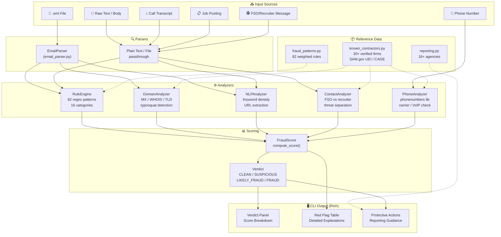
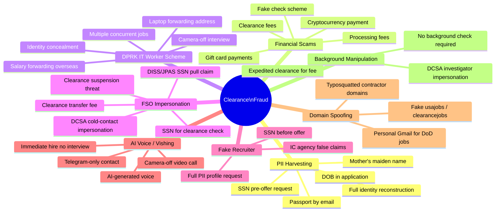
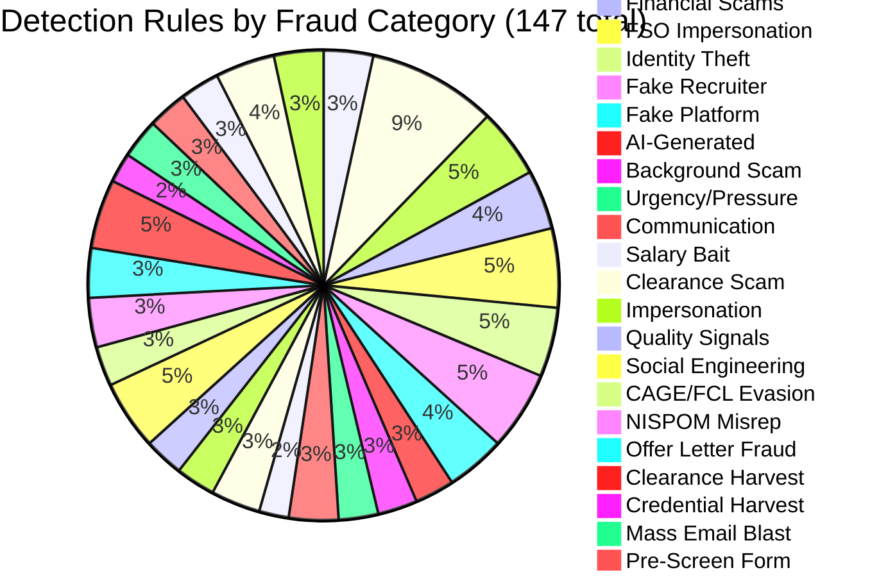
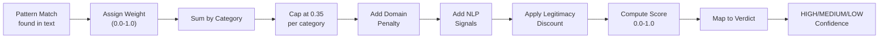
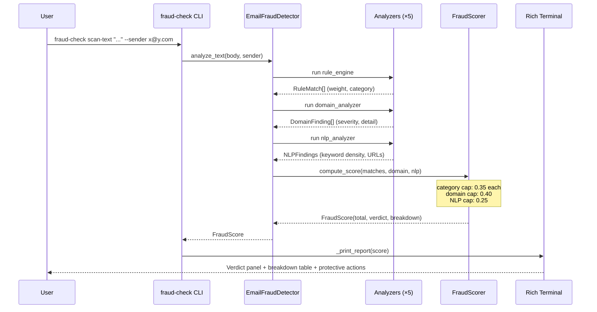
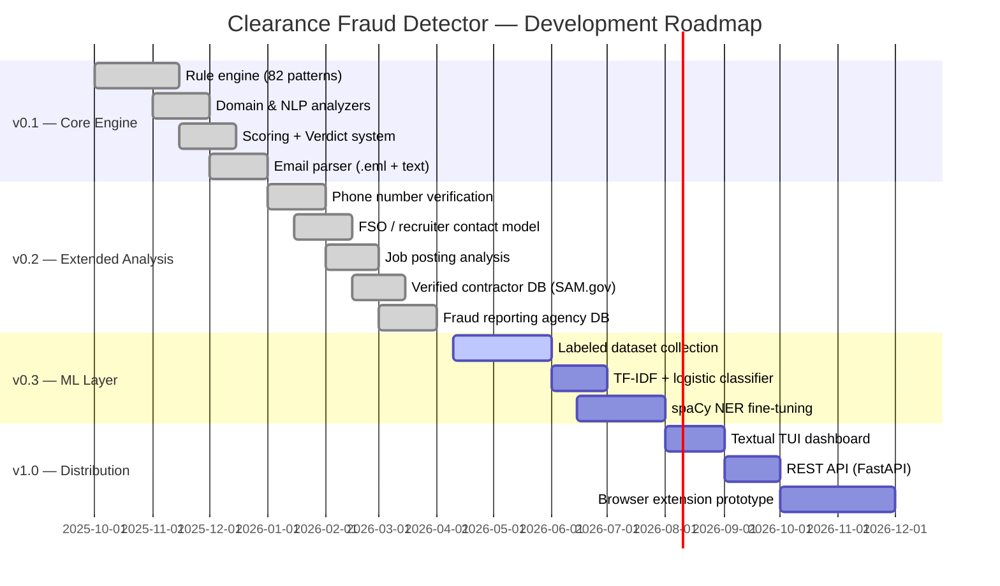

<div align="center">
  <h1>🛡️ Clearance Fraud Detector</h1>
  <p><em>CLI-first fraud detection for US security clearance job seekers — catches fake FSOs, DPRK IT worker schemes, PII harvesting, and AI voice fraud before you become a victim.</em></p>
</div>

<div align="center">

[](LICENSE)
[](https://github.com/hkevin01/clearance-fraud-detector/stargazers)
[](https://github.com/hkevin01/clearance-fraud-detector/network)
[](https://github.com/hkevin01/clearance-fraud-detector/commits/master)
[](https://github.com/hkevin01/clearance-fraud-detector)
[](https://github.com/hkevin01/clearance-fraud-detector/issues)
[](https://python.org)
[](tests/)
[](src/clearance_fraud_detector/data/fraud_patterns.py)
[](pyproject.toml)

</div>

---

## Table of Contents

- [Overview](#overview)
- [Key Features](#key-features)
- [Architecture](#architecture)
- [Fraud Taxonomy](#fraud-taxonomy)
- [Usage](#usage)
  - [Scan an Email](#scan-an-email)
  - [Analyze a Call Transcript](#analyze-a-call-transcript)
  - [Analyze a Job Posting](#analyze-a-job-posting)
  - [Check an FSO or Recruiter Contact](#check-an-fso-or-recruiter-contact)
  - [Verify a Phone Number](#verify-a-phone-number)
  - [Verify a Company](#verify-a-company)
  - [Generate Reporting Contacts](#generate-reporting-contacts)
- [Scoring System](#scoring-system)
- [Technology Stack](#technology-stack)
- [Setup & Installation](#setup--installation)
- [Project Structure](#project-structure)
- [Roadmap](#roadmap)
- [Contributing](#contributing)
- [Authoritative References](#authoritative-references)
- [License](#license)

---

## Overview

Clearance Fraud Detector is a command-line tool that analyzes emails, job postings, call transcripts, recruiter messages, and phone numbers for indicators of fraud targeting US security clearance holders and job seekers.

The tool addresses a specific, high-stakes threat landscape: adversaries — including North Korean state actors and domestic fraudsters — exploit the complexity of the DoD clearance process to harvest Social Security Numbers, conduct identity theft, and run employment scams. Unlike generic spam filters, this tool understands the NISPOM/DCSA process and uses that domain knowledge to distinguish legitimate contact from exploitation.

**Who it is for:** Active and former cleared personnel, clearance candidates, FSOs, HR security staff, and anyone navigating the cleared job market who wants a second opinion before engaging with a contact.

> [!IMPORTANT]
> This tool is a detection aid — not a legal determination of fraud. Always report suspicious contacts to DCSA (571-305-6576 | dcsacounterfraud@mail.mil) and FBI IC3 (ic3.gov).

<p align="right">(<a href="#top">back to top ↑</a>)</p>

---

## Key Features

| Icon | Feature | Description | Status |
|------|---------|-------------|--------|
| 📧 | **Email Analysis** | Scans `.eml` files or raw text against 147 detection rules across 27 fraud categories | ✅ Stable |
| 📞 | **Vishing / AI Voice Detection** | Analyzes call transcripts for AI-generated voice indicators, camera-off interviews, DPRK scheme signals | ✅ Stable |
| 📋 | **Job Posting Analysis** | Flags impossible salaries, PII-in-application, fake platforms, DPRK laptop-farm patterns | ✅ Stable |
| 🕵️ | **FSO / Recruiter Contact Analysis** | Distinguishes fake FSO SSN exploitation from fake recruiter PII harvest — different threat models | ✅ Stable |
| 📱 | **Phone Number Verification** | Validates numbers against published cleared-firm directories; flags VoIP, geographic mismatch, pre-offer SSN calls | ✅ Stable |
| 🏢 | **Company Verification** | Cross-references SAM.gov UEI, CAGE codes, GSA contracts, and known domains against verified contractor registry | ✅ Stable |
| 📊 | **Fraud Reporting Database** | 16+ official reporting agencies with phone/URL/email, prioritized by fraud type; DCSA OIG, FBI IC3, FTC, SSA OIG | ✅ Stable |
| 🔍 | **Domain Spoofing Detection** | Catches typosquatted contractor domains, fake .gov/.mil, personal-email-for-DoD-jobs | ✅ Stable |
| ⚖️ | **NISPOM §117.10 Compliance Check** | Maps interaction text to specific 32 CFR subsections with verbatim rule text, severity, and recommended action | ✅ Stable |
| 📄 | **Offer Letter Verification** | Detects SSN fields on offer letters, offers conditioned on SSN, free email domains, missing CAGE/address | ✅ Stable |
| 📖 | **Violation Explainer** | Translates detected patterns to verbatim CFR text + correct process + word-for-word response script | ✅ Stable |
| 📝 | **Incident Report Generator** | Produces DCSA/FBI-ready incident reports in plain text or Markdown | ✅ Stable |

**Standout capabilities:**
- Understands the DCSA eApp/DISS process — knows that a real FSO accesses DISS via their own credentials and any SSN in the system is already on file from a prior investigation; an FSO **never** cold-solicits your SSN as a "lookup trigger"
- Detects all 9 documented DPRK IT worker scheme indicators (FBI/CISA Advisory AA23-129A)
- Maps results to specific reporting agencies and generates an actionable checklist when SSN was already provided
- Verified contractor database includes SAM.gov UEI, CAGE codes, and GSA contract numbers for cross-referencing

<p align="right">(<a href="#top">back to top ↑</a>)</p>

---

## Architecture



### Component Responsibilities

| Component | File | Responsibility |
|-----------|------|----------------|
| `EmailFraudDetector` | `detector.py` | Top-level API — orchestrates all analyzers |
| `RuleEngine` | `analyzers/rule_engine.py` | Applies 147 weighted regex patterns; returns `RuleMatch` list |
| `DomainAnalyzer` | `analyzers/domain_analyzer.py` | WHOIS, MX records, TLD extraction, typosquat detection |
| `NLPAnalyzer` | `analyzers/nlp_analyzer.py` | Keyword density, URL extraction, legitimate vocab scoring |
| `ContactAnalyzer` | `analyzers/contact_analyzer.py` | FSO vs recruiter threat model; DISS process awareness |
| `PhoneAnalyzer` | `analyzers/phone_analyzer.py` | E.164 normalization, carrier lookup, VoIP detection |
| `NispomsComplianceChecker` | `analyzers/nispom_compliance.py` | Maps interaction text → 32 CFR §117.10 violations with verbatim rule text |
| `ProcessValidator` | `analyzers/process_validator.py` | Validates 6-step legal hiring sequence against NISPOM |
| `CompanyVerifier` | `analyzers/company_verifier.py` | CAGE code format + contractor lookup + interaction text fraud scan |
| `OfferLetterVerifier` | `analyzers/offer_letter_verifier.py` | Detects fake offer letters used for SSN harvest |
| `ViolationExplainer` | `scoring/explainer.py` | Maps pattern/category names → verbatim CFR citations + response scripts |
| `ReportGenerator` | `report_generator.py` | DCSA/FBI-ready incident report generation (plain text + Markdown) |
| `FraudScorer` | `scoring/scorer.py` | Aggregates findings → normalized 0.0–1.0 score + Verdict |
| `CLI` | `cli.py` | Typer commands + Rich terminal rendering (13 commands) |

<p align="right">(<a href="#top">back to top ↑</a>)</p>

---

## Fraud Taxonomy





<p align="right">(<a href="#top">back to top ↑</a>)</p>

---

## Usage

### Scan an Email

```bash
# Analyze a .eml file
fraud-check scan suspicious_offer.eml

# Analyze raw email text with metadata
fraud-check scan-text "Dear Applicant, processing fee of $150 required..." \
  --subject "TS/SCI Job Offer" \
  --sender "recruiter@dod-careers-hiring.com"
```

### Analyze a Call Transcript

```bash
# Paste transcript directly
fraud-check scan-call "The interviewer required camera off the entire time.
He asked me to confirm my SSN and DOB over the phone.
Contact him only via Telegram @bah_recruiter_john."

# Or pass a file
fraud-check scan-call interview_notes.txt
```

### Analyze a Job Posting

```bash
# Detect fake cleared job postings
fraud-check scan-job "TS/SCI Remote Developer — $400,000/yr — No Experience Required.
No background check needed. Laptop shipped to home address. Apply via Telegram."

fraud-check scan-job job_posting.txt
```

### Check an FSO or Recruiter Contact

```bash
# Detect fake FSO SSN exploitation vs fake recruiter PII harvest
fraud-check scan-contact "Our FSO needs your SSN to verify your clearance status in DISS."

fraud-check scan-contact recruiter_email.txt
```

> [!WARNING]
> A real FSO accesses DISS via their own credentialed login — any SSN in the system is already on file from a prior investigation. They **never** cold-collect your SSN as a "lookup trigger" via phone or email. Any contact framing it that way is running the #1 fake-FSO exploit.

### Verify a Phone Number

```bash
# Check phone against known cleared-firm directory
fraud-check scan-number "703-594-4241" \
  --company "22nd Century Tech" \
  --ssn-requested \
  --pre-offer

# With location cross-check
fraud-check scan-number "703-436-9068" --company "Mindbank" --region "Vienna VA"
```

### Verify a Company

```bash
# Full verified record (SAM UEI, CAGE, GSA contract)
fraud-check verify-company "Marathon TS"
fraud-check verify-company "Mindbank" --contacts
fraud-check verify-company "TSCTI"
```

### Check NISPOM §117.10 Compliance

```bash
# Check any recruiter or FSO message for regulatory violations
fraud-check compliance-check "Please send your SSN to ksingh@tscti.com to verify your clearance."

# Pass a file
fraud-check compliance-check tscti_email.txt
```

### Verify an Offer Letter

```bash
# Check offer letter for fake/fraudulent signals
fraud-check verify-offer offer_letter.txt
fraud-check verify-offer offer_letter.txt --sender "hr@gmail.com"
```

> [!WARNING]
> **Red flag:** SSN fields on an offer letter. SSN is entered directly by you into NBIS eApp at `eapp.nbis.mil` — it never belongs on a paper or PDF offer letter. Any offer letter with an SSN field is a PII harvest vehicle.

### Explain Detected Violations

```bash
# Lookup CFR citations for detected pattern names
fraud-check explain --pattern ssn_request
fraud-check explain --pattern dod_safe_ssn_channel --pattern clearance_self_attestation_request

# Lookup by violation category
fraud-check explain --category non_employee_check --category cache_building

# List all known pattern and category names
fraud-check explain --list
```

### Generate an Incident Report

```bash
# Generate a DCSA/FBI-ready incident report
fraud-check generate-report \
  --company "Mindbank Consulting Group" \
  --recruiter "Paulina Willingham" \
  --violation "Pre-offer SSN request via email" \
  --violation "SVP reaffirmed violation (Trisha Herrera)" \
  --interaction mindbank_emails.txt

# Save as Markdown
fraud-check generate-report \
  --company "Bad Corp" \
  --violation "Clearance self-attestation form sent pre-offer" \
  --format markdown \
  --save incident_report.md
```

### Generate Reporting Contacts

```bash
# All agencies
fraud-check report-fraud

# Filter by fraud type
fraud-check report-fraud --type fake_fso
fraud-check report-fraud --type dprk_scheme
fraud-check report-fraud --type ssn_stolen

# Immediate action checklist when SSN was already provided
fraud-check report-fraud --type ssn_stolen --ssn-given
```

### Run the Built-in Demo

```bash
# Fraud vs legitimate examples across all analysis modes
fraud-check demo
```

<details>
<summary>📋 All Available Commands</summary>

| Command | Description | Key Options |
|---------|-------------|-------------|
| `fraud-check scan <file.eml>` | Analyze a `.eml` email file | — |
| `fraud-check scan-text <body>` | Analyze raw email body | `--subject`, `--sender` |
| `fraud-check scan-call <transcript>` | Analyze call transcript / interview notes | file path accepted |
| `fraud-check scan-job <posting>` | Analyze a job posting | file path accepted |
| `fraud-check scan-contact <message>` | Analyze FSO or recruiter contact | file path accepted |
| `fraud-check scan-number <number>` | Check a phone number | `--company`, `--region`, `--ssn-requested`, `--pre-offer` |
| `fraud-check verify-company <name>` | Look up company in verified registry | `--contacts` |
| `fraud-check compliance-check <text>` | Check message for NISPOM §117.10 violations | file path accepted |
| `fraud-check verify-offer <file>` | Analyze an offer letter for fraud signals | `--sender` |
| `fraud-check explain` | Look up CFR citations for detected patterns | `--pattern`, `--category`, `--list` |
| `fraud-check generate-report` | Generate DCSA/FBI incident report | `--company`, `--recruiter`, `--violation`, `--format`, `--save` |
| `fraud-check report-fraud` | Show fraud reporting agencies | `--type`, `--ssn-given` |
| `fraud-check demo` | Run built-in demo examples | — |

</details>

<p align="right">(<a href="#top">back to top ↑</a>)</p>

---

## Pattern Reference

The detector uses **147 weighted regex patterns** organized into **27 threat categories**. Each pattern is assigned a weight (0.0–1.0) based on fraud severity and false-positive risk.

### Core Threat Categories

#### 🔴 High-Severity Patterns (0.70–1.00 weight)

| Category | Pattern Count | Key Indicators | Example Trigger |
|----------|---------------|---|---|
| **PII Harvest** | 5 | SSN request pre-offer, clearance level query, bank account info, passport request, DOB in application | "Please provide your Social Security Number for the clearance lookup" |
| **DPRK Scheme** | 13 | Camera off, laptop forwarding, salary forwarding, concurrent jobs, identity concealment, resume submission timing | "FedEx the laptop to this address in Singapore" |
| **Identity Theft** | 7 | Crypto redirect, SIM swap, bank credential capture, tax ID theft | "Verify your banking credentials to complete onboarding" |
| **Offer Letter Fraud** | 5 | SSN field on offer, offer conditioned on SSN, free email domain, missing address | "Sign this offer letter and provide your SSN to finalize" |
| **FSO Impersonation** | 8 | Fake DISS access claims, clearance suspension threat, DCSA cold contact, shared credentials demand | "Your clearance will be revoked unless you verify your SSN immediately" |

#### 🟠 Medium-Severity Patterns (0.40–0.70 weight)

| Category | Pattern Count | Key Indicators | Example Trigger |
|----------|---------------|---|---|
| **Fake Recruiter** | 8 | Bulk PII intake form, criminal history prescreen (pre-offer), competing offers probe, anonymous cleared client | "Confidential aerospace & defense client seeking TS/SCI contractor" |
| **AI-Generated Content** | 4 | AI writing patterns, AI voice interview claims, deepfake warnings | "This video interview will use AI voice synthesis" |
| **Fake Platform** | 6 | LinkedIn phishing pages, fake ClearanceJobs link, job board redirect | "Click here to apply on our secure portal: clr-jobs-apply.io" |
| **Financial Scams** | 6 | Processing fees, clearance application fees, gift card payment, wire transfer | "Non-refundable processing fee: $200" |
| **Background Scam** | 4 | FCRA timing violations, SSN collection timing, pre-offer background check | "We'll run your background check before making an offer" |
| **Clearance Scam** | 5 | Guaranteed clearance, fast-track hiring, remote TS/SCI work | "We guarantee TS/SCI clearance within 2 weeks" |

#### 🟡 Medium-Low Patterns (0.25–0.50 weight)

| Category | Pattern Count | Key Indicators | Example Trigger |
|----------|---------------|---|---|
| **Process Void/Ghost Employer** | 6 | "Resume on file" harvest, vague callback dates, indefinite job wait, no contact barrier, submit & disappear, no named contact | "We'll keep your resume on file for future opportunities" |
| **Urgency/Pressure** | 4 | Immediate response demanded, scarcity claim, decision deadline | "You have 24 hours to accept this offer" |
| **Communication Red Flags** | 5 | Personal email for government work, WhatsApp-only contact, offshore interview, no company name | "Contact me on WhatsApp: +855..." |
| **Workforce Mapping** | 5 | Program history probe, clearance status mapping, competitor intel collection, salary intel gathering, employment timeline | "What programs have you worked on in the last 5 years?" |
| **Vishing/AI Voice** | 7 | Fake interview call, no follow-up documentation, AI voice detection, camera-off requirement | "Join the video call but keep your camera off for security" |

#### 🟢 Lower-Severity Patterns (0.25–0.45 weight)

| Category | Pattern Count | Key Indicators | Example Trigger |
|----------|---------------|---|---|
| **Salary Bait** | 3 | Unrealistic salary ($300K+), work-from-home for TS/SCI, no-experience-required | "TS/SCI Remote: $400K + benefits, no experience needed" |
| **Impersonation** | 4 | Domain mismatch, IC agency false claims, government impersonation | "From: NSA Recruitment Team <nsa-recruit@nsarecruit.com>" |
| **Credential Harvest** | 3 | Fake login portal, government credentials phishing, DISS impersonation | "Visit https://diss-access.contractor.io to update your profile" |
| **NISPOM Misrepresentation** | 5 | False claims about NISPOM procedures, eApp misrepresentation, timeline fabrication | "You can start before your background check completes" |
| **Clearance Harvest** | 7 | History extraction, certification request, CAC/PIV request before offer | "Send us a copy of your TS/SCI certificate to verify clearance" |
| **CAGE/FCL Evasion** | 4 | Non-FCL contractor recruiting, FCL compliance bypass, Facility Clearance false claims | "We're a cleared facility but don't have FCL on file yet" |
| **Foreign Front** | 4 | Visa sponsorship scam, OPT extension guarantee, visa transfer promise | "We guarantee H-1B sponsorship within 30 days" |
| **Social Engineering** | 7 | Pressure tactics, deadline urgency, competitive pressure, manipulation | "Everyone else accepted already — you'll miss out" |
| **Pre-Screen Form** | 4 | Legal name + passport fields, clearance history multi-field form, anonymous client use | "Complete this pre-screen form with full legal name and passport number" |
| **Mass Email Blast** | 4 | Bulk unsubscribe, click-here tracking, clearance status fishing, bulk TS/SCI blast | "Cleared professionals: click here to update your profile" |
| **Quality Signals** | 4 | Excessive caps, multiple exclamations, generic greeting, premature congratulations | "CONGRATULATIONS!!! You've been pre-selected for our EXCLUSIVE TS/SCI opportunity!!!" |

### How Patterns Feed the Scoring System



**Scoring Algorithm:**
- Each matching pattern contributes its weight to its category score
- Category scores are capped at **0.35** to prevent single-category dominance
- Domain analyzer penalty (0.40 max) added for: spoofed domains, personal email for gov work, typosquatted sites
- NLP analyzer bonus (0.25 max) added for: keyword density, legitimacy vocabulary, URL extraction
- Legitimacy discount applied if 3+ legit-vocab hits AND no domain issues AND total < 0.70
- Final score normalized to 0.0–1.0 range

**Verdict Thresholds:**
- **CLEAN**: < 0.20
- **SUSPICIOUS**: 0.20–0.45
- **LIKELY_FRAUD**: 0.45–0.70
- **FRAUD**: ≥ 0.70

**Confidence Levels:**
- **HIGH**: 3+ categories triggered AND total score ≥ 0.45
- **MEDIUM**: 2+ categories triggered OR (2+ signals AND total ≥ 0.25)
- **LOW**: Otherwise

<p align="right">(<a href="#top">back to top ↑</a>)</p>

---

## Scoring System



Risk scores are normalized to 0.0–1.0 with per-category and per-source caps to prevent a single signal from dominating:

| Range | Verdict | Meaning |
|-------|---------|---------|
| 0.00 – 0.19 | ✅ **CLEAN** | No significant fraud indicators |
| 0.20 – 0.44 | ⚠️ **SUSPICIOUS** | Some red flags — verify independently |
| 0.45 – 0.69 | 🚨 **LIKELY FRAUD** | Strong fraud indicators — do not engage |
| 0.70 – 1.00 | 🛑 **FRAUD** | High-confidence fraud — report immediately |

> [!TIP]
> Use `fraud-check report-fraud --type <fraud_type>` to get the exact agencies to contact based on what was detected. Use `--ssn-given` if you already provided personal data for an immediate 11-step action checklist.

<p align="right">(<a href="#top">back to top ↑</a>)</p>

---

## Technology Stack

| Technology | Version | Purpose | Why Chosen |
|------------|---------|---------|------------|
| **Python** | 3.11+ | Runtime | Match target deployment environments in cleared DoD contractor workstations |
| **Typer** | 0.12+ | CLI framework | Type-annotated commands with automatic `--help` generation |
| **Rich** | 13.7+ | Terminal output | Color-coded verdict panels, tables, and progress — readable at a glance |
| **phonenumbers** | 8.13+ | Phone validation | Google's libphonenumber binding — E.164 normalization, carrier, region, VoIP type |
| **tldextract** | 5.1+ | Domain analysis | Accurate TLD/subdomain parsing needed for typosquat detection |
| **python-whois** | 0.9+ | WHOIS lookup | Registration age and registrar for suspicious domain detection |
| **spaCy** | 3.7+ | NLP pipeline | Named entity recognition and linguistic feature extraction |
| **scikit-learn** | 1.4+ | ML scoring | TF-IDF + logistic regression for future trained classifier layer |
| **rapidfuzz** | 3.0+ | Fuzzy matching | Levenshtein distance for contractor name impersonation detection |
| **pydantic** | 2.6+ | Data validation | Typed result objects with strict validation at analysis boundaries |
| **Textual** | 0.80+ | TUI framework | Reserved for future interactive terminal dashboard |

<p align="right">(<a href="#top">back to top ↑</a>)</p>

---

## Setup & Installation

**Prerequisites:** Python 3.11+, `uv` (recommended) or `pip`

```bash
# 1. Clone
git clone https://github.com/hkevin01/clearance-fraud-detector.git
cd clearance-fraud-detector

# 2. Create virtual environment
uv venv && source .venv/bin/activate
# or: python -m venv .venv && source .venv/bin/activate

# 3. Install with dev dependencies
uv pip install -e ".[dev]"
# or: pip install -e ".[dev]"

# 4. Verify installation
fraud-check --help

# 5. Run tests
pytest tests/ -v

# 6. Run full validation (tests + smoke checks)
bash scripts/run_validation.sh
# Expected: 259 passed
```

> [!NOTE]
> The CLI entry point `fraud-check` is registered via `pyproject.toml` and will be available after `pip install -e .`. No additional configuration or API keys are required — all detection is local and offline.

<p align="right">(<a href="#top">back to top ↑</a>)</p>

---

## Project Structure

```
clearance-fraud-detector/
├── pyproject.toml                  # Build config, dependencies, entry points (v0.2.0)
├── src/
│   └── clearance_fraud_detector/
│       ├── __init__.py
│       ├── detector.py             # EmailFraudDetector — top-level API (12 methods)
│       ├── cli.py                  # Typer + Rich CLI (13 commands)
│       ├── reporting.py            # 16+ reporting agencies + action checklist
│       ├── report_generator.py     # DCSA/FBI incident report generator
│       ├── analyzers/
│       │   ├── rule_engine.py      # Weighted regex rule matching
│       │   ├── domain_analyzer.py  # WHOIS / TLD / typosquat detection
│       │   ├── nlp_analyzer.py     # Keyword density + URL analysis
│       │   ├── contact_analyzer.py # FSO vs recruiter threat model
│       │   ├── phone_analyzer.py   # E.164 / carrier / VoIP check
│       │   ├── nispom_compliance.py # §117.10 compliance checker (8 violation rules)
│       │   ├── process_validator.py # 6-step legal hiring sequence validator
│       │   ├── company_verifier.py  # CAGE + domain + interaction text fraud scan
│       │   └── offer_letter_verifier.py # Fake offer letter detection
│       ├── data/
│       │   ├── fraud_patterns.py   # 87 compiled regex patterns, 20 categories
│       │   ├── known_contractors.py # 30+ verified firms (SAM UEI, CAGE, GSA)
│       │   ├── known_staffing_firms.py # 8 staffing firms; Mindbank flagged
│       │   └── cage_codes.py       # 15 prime contractor CAGE codes
│       ├── parsers/
│       │   └── email_parser.py     # .eml, raw string, plain text parsing
│       └── scoring/
│           ├── scorer.py           # Score aggregation → Verdict enum
│           └── explainer.py        # CFR citation mapper + response scripts
├── data/
│   └── samples/                    # 5 sample interaction files for testing
├── tests/
│   ├── test_detector.py            # core detector behavior and pattern coverage
│   ├── test_cli_integration.py     # CLI end-to-end command integration tests
│   ├── test_validation_smoke.py    # deterministic smoke tests for verdict/exit-code contracts
│   ├── test_nispom_compliance.py   # NISPOM §117.10 compliance checks
│   ├── test_process_validator.py   # hiring sequence validation
│   ├── test_company_verifier.py    # CAGE + domain verification
├── scripts/
│   └── run_validation.sh           # one-command validation run for local and CI use
│   ├── test_report_generator.py    # 22 tests — incident report generation
│   ├── test_explainer.py           # 44 tests — CFR citation mapper
│   ├── test_offer_letter.py        # 24 tests — offer letter fraud detection
│   └── test_staffing_firms.py      # 17 tests — staffing firm database
└── docs/
    ├── ssn-guidance-and-dcsa-tools.md  # When/how to provide SSN; DCSA systems guide
    └── fso-meeting-reference.md        # FSO meeting prep; §117.10 quick reference
```

<p align="right">(<a href="#top">back to top ↑</a>)</p>

---

## Roadmap



<details>
<summary>📅 Roadmap Table</summary>

| Phase | Goals | Target | Status |
|-------|-------|--------|--------|
| **v0.1 — Core Engine** | Rule engine, domain/NLP analyzers, scoring, email parser | Q4 2025 | ✅ Complete |
| **v0.2 — Extended Analysis** | Phone verification, contact model, job postings, contractor DB, reporting DB | Q1 2026 | ✅ Complete |
| **v0.3 — ML Layer** | Labeled dataset, TF-IDF classifier, spaCy NER fine-tuning | Q2–Q3 2026 | 🟡 In Progress |
| **v1.0 — Distribution** | Textual TUI, FastAPI REST endpoint, browser extension | Q4 2026 | ⭕ Planned |

</details>

<p align="right">(<a href="#top">back to top ↑</a>)</p>

---

## Contributing

1. Fork the repository
2. Create a feature branch: `git checkout -b feature/your-feature`
3. Write tests first — all changes require corresponding tests in `tests/test_detector.py`
4. Implement the change
5. Run the full suite: `pytest tests/ -v` — all 259 tests must pass
6. Open a Pull Request with a description of what fraud vector or detection gap is addressed

<details>
<summary>📋 Contribution Guidelines</summary>

**Adding a new fraud pattern:**
- Add to the appropriate `*_PATTERNS` list in `fraud_patterns.py`
- Assign a weight between 0.0 and 1.0 (1.0 = absolute fraud indicator)
- Assign the correct `category` string (must match existing categories or add to `ALL_PATTERNS`)
- Write a clear `explanation` string citing what real-world process invalidates this signal
- Add a test case in `TestDetector` that verifies the pattern fires and the score is above threshold

**Adding a verified contractor:**
- Requires: SAM.gov active registration, verifiable CAGE code, published corporate domain
- Add to `VERIFIED_CONTRACTORS` in `known_contractors.py` with `verified_sources` list
- Do not add companies without independently verifiable SAM.gov records

**Code style:**
- Ruff for linting: `ruff check src/`
- No type ignores without justification comment
- Pattern explanations must cite official NISPOM, DCSA, or FBI/CISA sources where applicable

</details>

<p align="right">(<a href="#top">back to top ↑</a>)</p>

---

## Authoritative References

All detection patterns, response text, and process descriptions in this tool are grounded in the following primary-source documents. Cross-reference these to verify any claim the tool makes.

### Federal Regulations & Executive Orders

| Document | Title | Relevance |
|---|---|---|
| **32 CFR Part 117** (NISPOM) | National Industrial Security Program Operating Manual — effective Feb 24, 2021 | §117.10(f): written offer + written acceptance required before investigation initiation; §117.10(a)(6): SSN submission to CSA for reciprocity; defines FSO responsibilities. [ecfr.gov](https://www.ecfr.gov/current/title-32/subtitle-B/chapter-I/subchapter-D/part-117) |
| **EO 12968** | Access to Classified Information — Aug 2, 1995 | Establishes eligibility standards for access to classified information; baseline for SEAD 4 adjudicative guidelines. [govinfo.gov](https://www.govinfo.gov/content/pkg/WCPD-1995-08-07/pdf/WCPD-1995-08-07-Pg1365.pdf) |
| **EO 13467** (as amended) | Reforming Processes Related to Suitability, Fitness, and Eligibility for Access to Classified National Security Information — Jun 30, 2008 | Foundation for Trusted Workforce 2.0; designates DNI as Security Executive Agent. [archives.gov](https://www.archives.gov/federal-register/codification/executive-order/13467.html) |
| **HSPD-12** | Policy for a Common Identification Standard for Federal Employees and Contractors — Aug 27, 2004 | Mandates PIV/CAC credential issuance; implemented by FIPS 201-3; governs physical/logical access credentials — **distinct from** the security clearance investigation process. [dhs.gov](https://www.dhs.gov/homeland-security-presidential-directive-12) |
| **5 CFR Part 731** | Suitability — OPM regulations | Governs federal employment suitability determinations (distinct from national security clearance adjudication). [ecfr.gov](https://www.ecfr.gov/current/title-5/chapter-I/subchapter-B/part-731) |

### NIST Standards

| Document | Title | Relevance |
|---|---|---|
| **FIPS 201-3** | Personal Identity Verification (PIV) of Federal Employees and Contractors — Jan 2022 | Governs CAC/PIV smart card credential issuance and identity proofing; implements HSPD-12. **Scope note:** governs PIV card issuance, not security clearance investigation. [csrc.nist.gov](https://csrc.nist.gov/pubs/fips/201-3/final) · [PDF](https://nvlpubs.nist.gov/nistpubs/FIPS/NIST.FIPS.201-3.pdf) |
| **NIST SP 800-73-5** | Interfaces for Personal Identity Verification — 2023 | Technical interface spec for PIV credentials (data model, card commands). [csrc.nist.gov](https://csrc.nist.gov/pubs/sp/800/73/pt1/5/final) |
| **NIST SP 800-76-2** | Biometric Specifications for Personal Identity Verification — 2013 | Biometric data format requirements for PIV cards. [csrc.nist.gov](https://csrc.nist.gov/pubs/sp/800/76/2/final) |

### Intelligence Community Directives (ODNI/NCSC)

| Document | Title | Relevance |
|---|---|---|
| **SEAD 4** | National Security Adjudicative Guidelines — Jun 8, 2017 | The 13 adjudicative guidelines applied by DCSA to determine clearance eligibility; source for what constitutes a disqualifying factor vs. mitigated concern. [dni.gov PDF](https://www.dni.gov/files/NCSC/documents/Regulations/SEAD-4-Adjudicative-Guidelines-U.pdf) |
| **SEAD 7** | Reciprocity of Background Investigation and National Security Adjudicative Determinations — 2016 | Requires agencies to honor prior clearance determinations; underpins FSO-to-FSO transfer flow through DISS and the CVS reciprocity check. [dni.gov](https://www.dni.gov/index.php/ncsc-home) |
| **ICD 704** | Personnel Security Standards and Procedures Governing Eligibility for Access to SCI — Jun 20, 2018 | SCI-specific personnel security standards; governs SSN and PII handling in the SCI access process. [dni.gov PDF](https://www.dni.gov/files/documents/ICD/ICD-704-Personnel-Security-Standards-and-Procedures-for-Access-to-SCI-2018-06-20.pdf) |
| **ICD 705** | Sensitive Compartmented Information Facilities (SCIFs) — May 26, 2010 | SCIF construction and accreditation requirements; provides context for SCIF-specific language used in legitimate FSO contacts. [dni.gov PDF](https://www.dni.gov/files/documents/ICD/ICD-705-SCIFs.pdf) |

### DoD Directives & Manuals

| Document | Title | Relevance |
|---|---|---|
| **DoD Manual 5200.02** | Procedures for the DoD Personnel Security Program (PSP) — Apr 3, 2017 | Detailed procedural guidance for DoD security clearances; FSO responsibilities; SF-86 processing timelines. [esd.whs.mil PDF](https://www.esd.whs.mil/Portals/54/Documents/DD/issuances/dodm/520002m.PDF) |
| **DoD Directive 5220.6** | Defense Industrial Personnel Security Clearance Review Program — Jan 2, 1992 (with changes) | Governs due process and appeal procedures for industrial contractor clearance reviews via DOHA. [esd.whs.mil PDF](https://www.esd.whs.mil/Portals/54/Documents/DD/issuances/dodd/522006p.pdf) |

### DCSA Systems & Portals

| System | URL | Purpose | Fraud Context |
|---|---|---|---|
| **DISS** — Defense Information System for Security | `dissportal.nbis.mil` (JVS) · `disscats.nbis.mil` (CATS/Appeals) | Enterprise system of record for DoD personnel security, suitability, and credentialing; replaced JPAS March 31, 2021 | FSO accesses via own credentialed login; any SSN in DISS is already on file from a prior investigation — FSO never cold-solicits SSN as a "lookup trigger" |
| **NBIS eApp** | `eapp.nbis.mil` | Electronic SF-86/SF-85P application portal; replaced e-QIP; FSO-initiated, candidate completes | The **only** authorized channel for a candidate to submit SSN/PII for a background investigation |
| **NBIS Subject Portal** | `sps.nbis.mil` | Candidate self-service: check investigation status, access prior completed investigations | |
| **CVS** — Central Verification System | (within DISS) | FSO checks whether an existing adjudication or investigation already meets the current need before requesting a new one | |
| **SWFT** — Secure Web Fingerprint Transmission | `swft.nbis.mil` | Electronic fingerprint submission to DCSA | Conducted in person at a cleared facility — never remotely |
| **DOD SAFE** | `safe.apps.mil` | DISA secure file transfer for CUI/PII supporting documents; 7-day auto-delete; requires DoD CAC by sender | **Not** an SF-86 submission channel; any recruiter sending a "DOD SAFE" link for PII collection is a fraud indicator |

**DCSA documentation:**
- DISS: [dcsa.mil/Systems-Applications/Defense-Information-System-for-Security-DISS](https://www.dcsa.mil/Systems-Applications/Defense-Information-System-for-Security-DISS/)
- NBIS eApp: [dcsa.mil/.../NBIS-eApp-NBIS-Agency](https://www.dcsa.mil/Systems-Applications/National-Background-Investigation-Services-NBIS/NBIS-eApp-NBIS-Agency/)
- Trust Decision (Adjudications): [dcsa.mil/Personnel-Vetting/Trust-Decision-Adjudications](https://www.dcsa.mil/mc/pv/adjudications/adjudicative-guidelines/)
- Background Investigations for Applicants: [dcsa.mil/Personnel-Vetting/Background-Investigations-for-Applicants](https://www.dcsa.mil/Personnel-Vetting/Background-Investigations-for-Applicants/)

### Threat Intelligence Advisories

| Document | Issuer | Relevance |
|---|---|---|
| **Advisory AA23-129A** — North Korean State-Sponsored Cyber Actors / IT Worker Scheme | FBI, CISA, NSA — May 9, 2023 | Source for all 9 DPRK IT worker scheme detection indicators; documents camera-off, Telegram-only, fake identity, and financial redirection patterns. [cisa.gov](https://www.cisa.gov/news-events/cybersecurity-advisories/aa23-129a) |
| **DCSA Cleared Industry Fraud Advisories** | DCSA Counterintelligence | Ongoing advisories on fake FSO impersonation, fake clearance brokers, and resume-harvesting operations targeting cleared contractors. [dcsa.mil/MC/CI](https://www.dcsa.mil/MC/CI/) |
| **FBI Private Industry Notifications** | FBI Cyber Division | Periodic PINs on social-engineering attacks targeting cleared personnel and cleared contractor recruitment fraud. [ic3.gov](https://www.ic3.gov) |

### Supporting Consumer References

| Source | URL | Used For |
|---|---|---|
| **FTC IdentityTheft.gov** | [identitytheft.gov](https://www.identitytheft.gov) | Post-SSN-compromise recovery checklist and step-by-step remediation guidance |
| **SSA CBSV** | [ssa.gov/cbsv](https://www.ssa.gov/cbsv/) | Confirmed that CBSV is a **commercial banking/mortgage tool** and is explicitly NOT used by DoD FSOs or DCSA for clearance verification |
| **SAM.gov** | [sam.gov](https://sam.gov) | Verify contractor registration, CAGE code, and active DoD contract status for any company claiming to be a cleared facility |
| **USAJobs.gov** | [usajobs.gov](https://www.usajobs.gov) | Authoritative source for federal and IC agency job postings; IC agencies (NSA, CIA, DIA, NRO, NGA) recruit exclusively through here |

<p align="right">(<a href="#top">back to top ↑</a>)</p>

---

## License

This project is licensed under the MIT License.

**Acknowledgements:**
- FBI/CISA Advisory AA23-129A — DPRK IT worker scheme indicators
- NISPOM (32 CFR Part 117) — SSN collection timing requirements
- DCSA eApp/DISS process documentation at dcsa.mil
- IdentityTheft.gov recovery framework (FTC)
- phonenumbers library (Google libphonenumber)

> [!CAUTION]
> This tool does not access DISS, JPAS, or any government clearance database. It performs local static analysis only. Never share cleared personnel data with any third-party tool, including this one. Scan only your own messages and communications.

<p align="right">(<a href="#top">back to top ↑</a>)</p>
