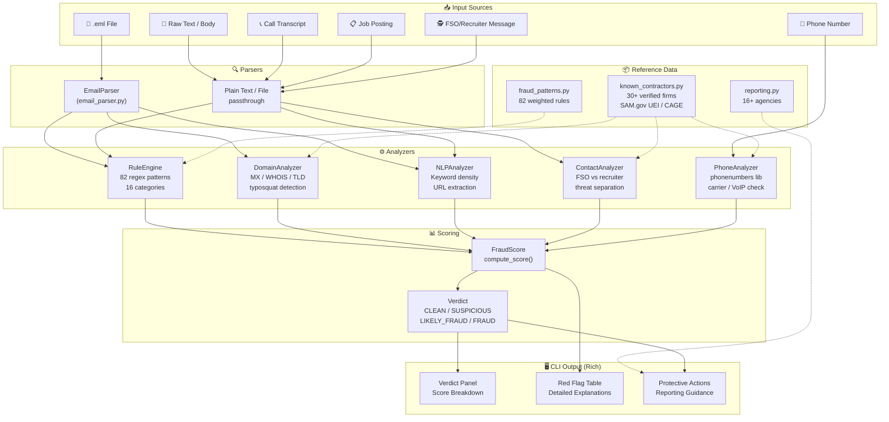
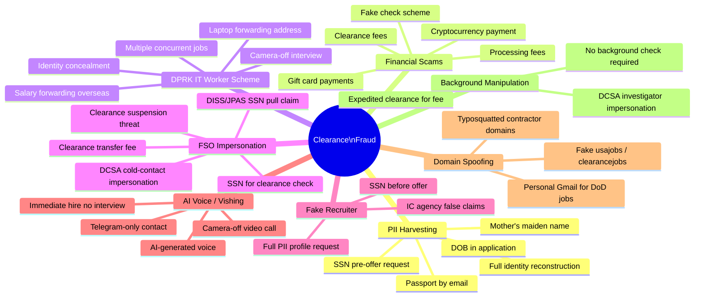
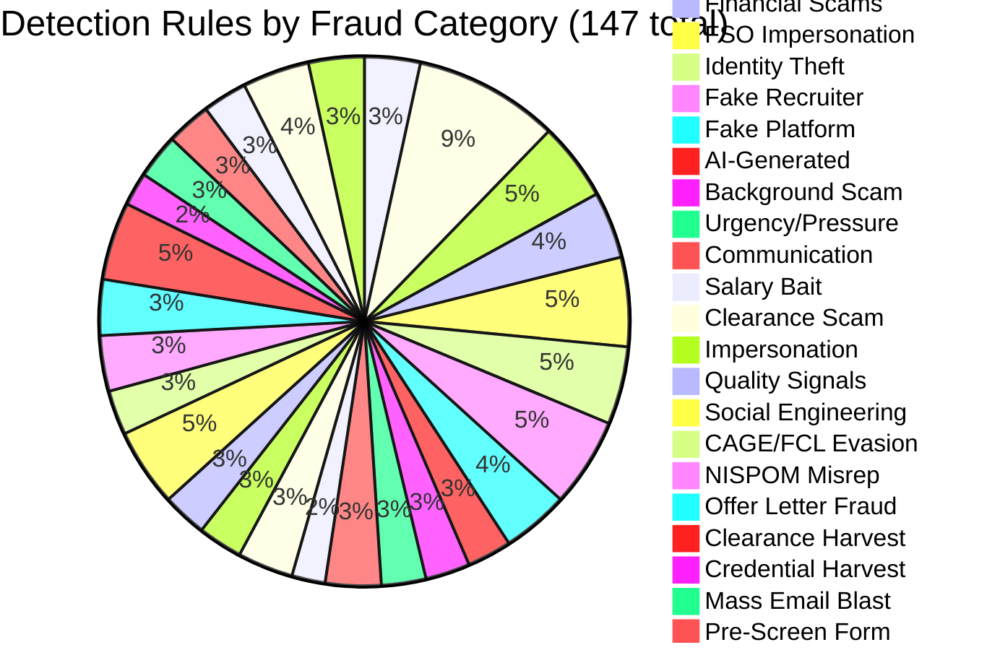
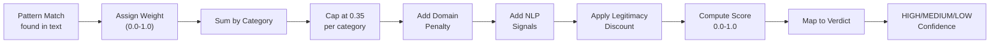
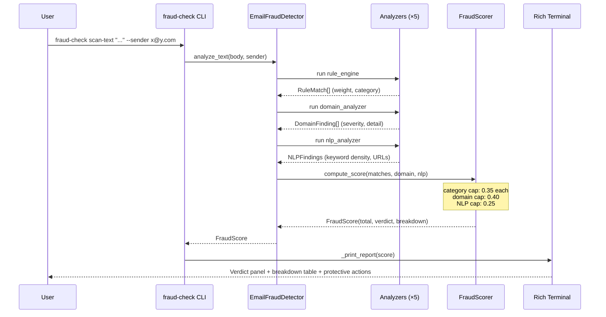
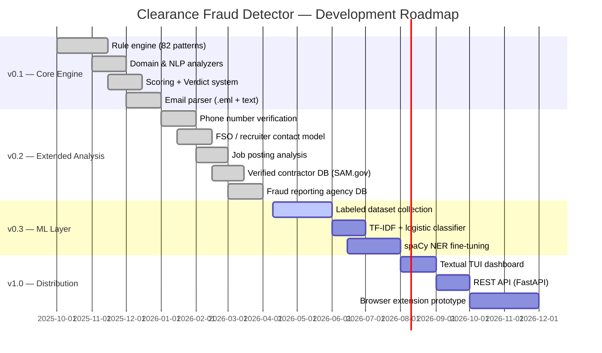

<div align="center">
  <h1>🛡️ Clearance Fraud Detector</h1>
  <p><em>CLI-first fraud detection for US security clearance job seekers — catches fake FSOs, DPRK IT worker schemes, PII harvesting, and AI voice fraud before you become a victim.</em></p>
</div>

<div align="center">

[](LICENSE)
[](https://github.com/hkevin01/clearance-fraud-detector/stargazers)
[](https://github.com/hkevin01/clearance-fraud-detector/network)
[](https://github.com/hkevin01/clearance-fraud-detector/commits/master)
[](https://github.com/hkevin01/clearance-fraud-detector)
[](https://github.com/hkevin01/clearance-fraud-detector/issues)
[](https://python.org)
[](tests/)
[](src/clearance_fraud_detector/data/fraud_patterns.py)
[](pyproject.toml)

</div>

---

## Table of Contents

- [FBI Ecosystem Fit (What Exists vs What This Adds)](#fbi-ecosystem-fit-what-exists-vs-what-this-adds)
- [Overview](#overview)
- [Key Features](#key-features)
- [Architecture](#architecture)
- [Fraud Taxonomy](#fraud-taxonomy)
- [Usage](#usage)
  - [Scan an Email](#scan-an-email)
  - [Analyze a Call Transcript](#analyze-a-call-transcript)
  - [Analyze a Job Posting](#analyze-a-job-posting)
  - [Check an FSO or Recruiter Contact](#check-an-fso-or-recruiter-contact)
  - [Verify a Phone Number](#verify-a-phone-number)
  - [Verify a Company](#verify-a-company)
  - [Generate Reporting Contacts](#generate-reporting-contacts)
- [Scoring System](#scoring-system)
- [Technology Stack](#technology-stack)
- [Setup & Installation](#setup--installation)
- [Project Structure](#project-structure)
- [Roadmap](#roadmap)
- [Contributing](#contributing)
- [Authoritative References](#authoritative-references)
- [License](#license)

---

## FBI Ecosystem Fit (What Exists vs What This Adds)

This project is currently a prototype decision-support layer. It does not replace FBI or CJIS systems. It is designed to sit in front of existing reporting and law-enforcement workflows to improve triage speed, data quality, and victim guidance.

### What Already Exists (Official FBI/CJIS Capabilities)

| <sub>Existing FBI/CJIS System</sub> | <sub>What It Already Does Well</sub> | <sub>Current Operational Focus</sub> |
|---|---|---|
| <sub>IC3 (Internet Crime Complaint Center)</sub> | <sub>Public intake for cyber-enabled crime; analyzes and disseminates reports for investigative/intelligence use</sub> | <sub>Public reporting and trend visibility</sub> |
| <sub>tips.fbi.gov (Electronic Tip Form)</sub> | <sub>Public federal crime and terrorism tip intake with Privacy Act framework</sub> | <sub>General public tip submission</sub> |
| <sub>CJIS Division</sub> | <sub>National criminal justice data hub serving law enforcement, national security partners, and public services</sub> | <sub>Data infrastructure and partner services</sub> |
| <sub>NCIC (via CJIS/LEEP)</sub> | <sub>Nationwide, near-real-time law-enforcement query/record system; officer-safety critical</sub> | <sub>Operational law-enforcement records access</sub> |
| <sub>LEEP</sub> | <sub>Secure portal for law-enforcement/intelligence collaboration tools and case support services</sub> | <sub>Federated law-enforcement collaboration</sub> |
| <sub>eGuardian (hosted on LEEP)</sub> | <sub>Suspicious Activity Reporting (SAR) sharing and fusion-center/JTTF workflow support</sub> | <sub>Counterterrorism information sharing</sub> |
| <sub>UCR/NIBRS Program</sub> | <sub>National crime-statistics collection and publication</sub> | <sub>Statistical reporting and analysis</sub> |
| <sub>CJIS Security Policy Resource Center</sub> | <sub>Security baseline (policy and controls) for handling criminal justice information</sub> | <sub>Compliance and security governance</sub> |
| <sub>Details</sub> | <sub>Expanded context is provided in the surrounding subsection; this compact table format is tuned for readability without horizontal scrolling.</sub> | <sub>—</sub> |

### Where This Prototype Adds Value

| <sub>Gap Before Official Intake</sub> | <sub>What Clearance Fraud Detector Adds</sub> | <sub>Who Benefits</sub> |
|---|---|---|
| <sub>Victims are unsure whether contact is legitimate before reporting</sub> | <sub>Structured pre-intake fraud scoring for clearance-themed scams (fake FSO/recruiter, PII harvesting, offer-letter abuse, DPRK IT-worker signals)</sub> | <sub>Public users, recruiters, cleared candidates</sub> |
| <sub>Reports often arrive with incomplete context</sub> | <sub>Normalized evidence extraction (sender/domain, phone, indicators, rationale, recommended escalation package)</sub> | <sub>FBI/IC3 analysts, fusion/support staff</sub> |
| <sub>Mixed quality of early triage across organizations</sub> | <sub>Repeatable rules + consistent severity banding to prioritize likely fraud faster</sub> | <sub>Federal/state/local partner workflows</sub> |
| <sub>Users do not know where to report first</sub> | <sub>Built-in routing guidance to the right agency path (IC3/FBI/DCSA/FTC etc.) based on fraud pattern</sub> | <sub>Public users and security teams</sub> |
| <sub>Public-facing language is hard to operationalize</sub> | <sub>Human-readable explanations translated into actionable checklist steps</sub> | <sub>Victims and help-desk/frontline teams</sub> |
| <sub>Details</sub> | <sub>Expanded context is provided in the surrounding subsection; this compact table format is tuned for readability without horizontal scrolling.</sub> | <sub>—</sub> |

### Capability Matrix (Requested Format)

| <sub>Capability</sub> | <sub>Federal Agencies</sub> | <sub>This Tool</sub> | <sub>What It Is</sub> | <sub>Why It's Needed</sub> |
|---|---|---|---|---|
| <sub>Cyber-enabled fraud intake</sub> | <sub>FBI IC3, FBI tip line, partner LE agencies</sub> | <sub>Pre-intake scam screening and evidence packaging</sub> | <sub>A local analysis pass that scores suspected scam content and structures key indicators before formal submission</sub> | <sub>Improves report quality and reduces ambiguity so official intake receives clearer, actionable context</sub> |
| <sub>Clearance-specific threat triage</sub> | <sub>FBI, DCSA, agency security offices, fusion/JTTF support workflows</sub> | <sub>Domain-specific detection for fake FSO/recruiter patterns</sub> | <sub>A ruleset tuned to cleared-workforce scam patterns (PII coercion, fake compliance asks, process misuse)</sub> | <sub>Generic spam tools miss clearance-process abuse; this closes that gap upstream</sub> |
| <sub>Cross-agency reporting path guidance</sub> | <sub>IC3, FBI field offices/tips, DCSA counter-fraud, FTC and other civilian channels</sub> | <sub>Context-based recommended reporting path</sub> | <sub>A routing layer that suggests where to report first based on observed fraud pattern</sub> | <sub>Victims often delay or report to the wrong channel; routing improves speed and handoff quality</sub> |
| <sub>Early triage consistency</sub> | <sub>Federal, state, local law-enforcement partner ecosystems</sub> | <sub>Deterministic scoring + severity bands</sub> | <sub>A repeatable framework to classify likely risk level and summarize top reasons</sub> | <sub>Reduces analyst-to-analyst variance in early assessment and supports prioritization</sub> |
| <sub>Victim-safe operational guidance</sub> | <sub>Public-facing FBI safety ecosystem and agency help desks</sub> | <sub>Plain-language protective action checklist</sub> | <sub>Human-readable next steps for preserving evidence, limiting harm, and escalating safely</sub> | <sub>Converts technical findings into immediate actions users can follow without specialized training</sub> |
| <sub>Details</sub> | <sub>Expanded context is provided in the surrounding subsection; this compact table format is tuned for readability without horizontal scrolling.</sub> | <sub>—</sub> | <sub>—</sub> | <sub>—</sub> |

### Integration Concept (Engineering Into Existing Flow)

| <sub>Current State</sub> | <sub>Near-Term Integration Step</sub> | <sub>Result</sub> |
|---|---|---|
| <sub>Standalone prototype analyzer</sub> | <sub>Package as API/microservice with JSON output schema for intake systems</sub> | <sub>Machine-ingestible pre-triage artifact</sub> |
| <sub>Manual analyst review of free-form text</sub> | <sub>Add adapter to ingest portal/tip payloads and return risk profile + extracted entities</sub> | <sub>Faster first-pass triage</sub> |
| <sub>No common pre-screen rubric across partner teams</sub> | <sub>Deploy deterministic ruleset profile for clearance-fraud category</sub> | <sub>More consistent triage decisions</sub> |
| <sub>Separate public guidance and law-enforcement evidence prep</sub> | <sub>Generate dual output: victim-safe instructions + investigator-ready indicator summary</sub> | <sub>Better user outcomes and cleaner handoffs</sub> |
| <sub>Ad hoc feedback loop</sub> | <sub>Add analyst feedback capture to tune weights/pattern precision over time</sub> | <sub>Continuous model/rule improvement</sub> |
| <sub>Details</sub> | <sub>Expanded context is provided in the surrounding subsection; this compact table format is tuned for readability without horizontal scrolling.</sub> | <sub>—</sub> |

### Delivery Status (Now vs Next)

| <sub>Workstream</sub> | <sub>Status Today</sub> | <sub>What This Tool Can Add Next</sub> |
|---|---|---|
| <sub>Pre-intake scam detection</sub> | <sub>Prototype complete (rule/NLP/domain/contact scoring)</sub> | <sub>Hardened service endpoints, authz, rate limits</sub> |
| <sub>Public user guidance</sub> | <sub>Present</sub> | <sub>Context-aware guided reporting wizard</sub> |
| <sub>Law-enforcement handoff quality</sub> | <sub>Partial</sub> | <sub>Standardized exchange format and partner integration adapters</sub> |
| <sub>Compliance posture</sub> | <sub>Baseline references included</sub> | <sub>Formal CJIS-aligned security controls, audit logging, and ATO-ready documentation</sub> |
| <sub>Multi-agency utility</sub> | <sub>Candidate capability</sub> | <sub>Role-specific views for public, recruiter/FSO, and federal analyst personas</sub> |
| <sub>Details</sub> | <sub>Expanded context is provided in the surrounding subsection; this compact table format is tuned for readability without horizontal scrolling.</sub> | <sub>—</sub> |

**Bottom line:** FBI/CJIS systems already provide the authoritative intake, records, and investigative infrastructure. This project contributes an upstream fraud-specialized triage and evidence-normalization layer that can reduce noise and improve signal quality before cases enter those official channels.

<p align="right">(<a href="#top">back to top ↑</a>)</p>

---

## Overview

Clearance Fraud Detector is a command-line tool that analyzes emails, job postings, call transcripts, recruiter messages, and phone numbers for indicators of fraud targeting US security clearance holders and job seekers.

The tool addresses a specific, high-stakes threat landscape: adversaries — including North Korean state actors and domestic fraudsters — exploit the complexity of the DoD clearance process to harvest Social Security Numbers, conduct identity theft, and run employment scams. Unlike generic spam filters, this tool understands the NISPOM/DCSA process and uses that domain knowledge to distinguish legitimate contact from exploitation.

**Who it is for:** Active and former cleared personnel, clearance candidates, FSOs, HR security staff, and anyone navigating the cleared job market who wants a second opinion before engaging with a contact.

> [!IMPORTANT]
> This tool is a detection aid — not a legal determination of fraud. Always report suspicious contacts to DCSA (571-305-6576 | dcsacounterfraud@mail.mil) and FBI IC3 (ic3.gov).

<p align="right">(<a href="#top">back to top ↑</a>)</p>

---

## Key Features

| <sub>Icon</sub> | <sub>Feature</sub> | <sub>Description</sub> | <sub>Status</sub> |
|------|---------|-------------|--------|
| <sub>📧</sub> | <sub>**Email Analysis**</sub> | <sub>Scans `.eml` files or raw text against 147 detection rules across 27 fraud categories</sub> | <sub>✅ Stable</sub> |
| <sub>📞</sub> | <sub>**Vishing / AI Voice Detection**</sub> | <sub>Analyzes call transcripts for AI-generated voice indicators, camera-off interviews, DPRK scheme signals</sub> | <sub>✅ Stable</sub> |
| <sub>📋</sub> | <sub>**Job Posting Analysis**</sub> | <sub>Flags impossible salaries, PII-in-application, fake platforms, DPRK laptop-farm patterns</sub> | <sub>✅ Stable</sub> |
| <sub>🕵️</sub> | <sub>**FSO / Recruiter Contact Analysis**</sub> | <sub>Distinguishes fake FSO SSN exploitation from fake recruiter PII harvest — different threat models</sub> | <sub>✅ Stable</sub> |
| <sub>📱</sub> | <sub>**Phone Number Verification**</sub> | <sub>Validates numbers against published cleared-firm directories; flags VoIP, geographic mismatch, pre-offer SSN calls</sub> | <sub>✅ Stable</sub> |
| <sub>🏢</sub> | <sub>**Company Verification**</sub> | <sub>Cross-references SAM.gov UEI, CAGE codes, GSA contracts, and known domains against verified contractor registry</sub> | <sub>✅ Stable</sub> |
| <sub>📊</sub> | <sub>**Fraud Reporting Database**</sub> | <sub>16+ official reporting agencies with phone/URL/email, prioritized by fraud type; DCSA OIG, FBI IC3, FTC, SSA OIG</sub> | <sub>✅ Stable</sub> |
| <sub>🔍</sub> | <sub>**Domain Spoofing Detection**</sub> | <sub>Catches typosquatted contractor domains, fake .gov/.mil, personal-email-for-DoD-jobs</sub> | <sub>✅ Stable</sub> |
| <sub>⚖️</sub> | <sub>**NISPOM §117.10 Compliance Check**</sub> | <sub>Maps interaction text to specific 32 CFR subsections with verbatim rule text, severity, and recommended action</sub> | <sub>✅ Stable</sub> |
| <sub>📄</sub> | <sub>**Offer Letter Verification**</sub> | <sub>Detects SSN fields on offer letters, offers conditioned on SSN, free email domains, missing CAGE/address</sub> | <sub>✅ Stable</sub> |
| <sub>📖</sub> | <sub>**Violation Explainer**</sub> | <sub>Translates detected patterns to verbatim CFR text + correct process + word-for-word response script</sub> | <sub>✅ Stable</sub> |
| <sub>📝</sub> | <sub>**Incident Report Generator**</sub> | <sub>Produces DCSA/FBI-ready incident reports in plain text or Markdown</sub> | <sub>✅ Stable</sub> |
| <sub>Details</sub> | <sub>Expanded context is provided in the surrounding subsection; this compact table format is tuned for readability without horizontal scrolling.</sub> | <sub>—</sub> | <sub>—</sub> |

**Standout capabilities:**
- Understands the DCSA eApp/DISS process — knows that a real FSO accesses DISS via their own credentials and any SSN in the system is already on file from a prior investigation; an FSO **never** cold-solicits your SSN as a "lookup trigger"
- Detects all 9 documented DPRK IT worker scheme indicators (FBI/CISA Advisory AA23-129A)
- Maps results to specific reporting agencies and generates an actionable checklist when SSN was already provided
- Verified contractor database includes SAM.gov UEI, CAGE codes, and GSA contract numbers for cross-referencing

<p align="right">(<a href="#top">back to top ↑</a>)</p>

---

## Architecture



### Component Responsibilities

| <sub>Component</sub> | <sub>File</sub> | <sub>Responsibility</sub> |
|-----------|------|----------------|
| <sub>`EmailFraudDetector`</sub> | <sub>`detector.py`</sub> | <sub>Top-level API — orchestrates all analyzers</sub> |
| <sub>`RuleEngine`</sub> | <sub>`analyzers/rule_engine.py`</sub> | <sub>Applies 147 weighted regex patterns; returns `RuleMatch` list</sub> |
| <sub>`DomainAnalyzer`</sub> | <sub>`analyzers/domain_analyzer.py`</sub> | <sub>WHOIS, MX records, TLD extraction, typosquat detection</sub> |
| <sub>`NLPAnalyzer`</sub> | <sub>`analyzers/nlp_analyzer.py`</sub> | <sub>Keyword density, URL extraction, legitimate vocab scoring</sub> |
| <sub>`ContactAnalyzer`</sub> | <sub>`analyzers/contact_analyzer.py`</sub> | <sub>FSO vs recruiter threat model; DISS process awareness</sub> |
| <sub>`PhoneAnalyzer`</sub> | <sub>`analyzers/phone_analyzer.py`</sub> | <sub>E.164 normalization, carrier lookup, VoIP detection</sub> |
| <sub>`NispomsComplianceChecker`</sub> | <sub>`analyzers/nispom_compliance.py`</sub> | <sub>Maps interaction text → 32 CFR §117.10 violations with verbatim rule text</sub> |
| <sub>`ProcessValidator`</sub> | <sub>`analyzers/process_validator.py`</sub> | <sub>Validates 6-step legal hiring sequence against NISPOM</sub> |
| <sub>`CompanyVerifier`</sub> | <sub>`analyzers/company_verifier.py`</sub> | <sub>CAGE code format + contractor lookup + interaction text fraud scan</sub> |
| <sub>`OfferLetterVerifier`</sub> | <sub>`analyzers/offer_letter_verifier.py`</sub> | <sub>Detects fake offer letters used for SSN harvest</sub> |
| <sub>`ViolationExplainer`</sub> | <sub>`scoring/explainer.py`</sub> | <sub>Maps pattern/category names → verbatim CFR citations + response scripts</sub> |
| <sub>`ReportGenerator`</sub> | <sub>`report_generator.py`</sub> | <sub>DCSA/FBI-ready incident report generation (plain text + Markdown)</sub> |
| <sub>`FraudScorer`</sub> | <sub>`scoring/scorer.py`</sub> | <sub>Aggregates findings → normalized 0.0–1.0 score + Verdict</sub> |
| <sub>`CLI`</sub> | <sub>`cli.py`</sub> | <sub>Typer commands + Rich terminal rendering (13 commands)</sub> |
| <sub>Details</sub> | <sub>Expanded context is provided in the surrounding subsection; this compact table format is tuned for readability without horizontal scrolling.</sub> | <sub>—</sub> |

<p align="right">(<a href="#top">back to top ↑</a>)</p>

---

## Fraud Taxonomy





<p align="right">(<a href="#top">back to top ↑</a>)</p>

---

## Usage

### Scan an Email

```bash
# Analyze a .eml file
fraud-check scan suspicious_offer.eml

# Analyze raw email text with metadata
fraud-check scan-text "Dear Applicant, processing fee of $150 required..." \
  --subject "TS/SCI Job Offer" \
  --sender "recruiter@dod-careers-hiring.com"
```

### Analyze a Call Transcript

```bash
# Paste transcript directly
fraud-check scan-call "The interviewer required camera off the entire time.
He asked me to confirm my SSN and DOB over the phone.
Contact him only via Telegram @bah_recruiter_john."

# Or pass a file
fraud-check scan-call interview_notes.txt
```

### Analyze a Job Posting

```bash
# Detect fake cleared job postings
fraud-check scan-job "TS/SCI Remote Developer — $400,000/yr — No Experience Required.
No background check needed. Laptop shipped to home address. Apply via Telegram."

fraud-check scan-job job_posting.txt
```

### Check an FSO or Recruiter Contact

```bash
# Detect fake FSO SSN exploitation vs fake recruiter PII harvest
fraud-check scan-contact "Our FSO needs your SSN to verify your clearance status in DISS."

fraud-check scan-contact recruiter_email.txt
```

> [!WARNING]
> A real FSO accesses DISS via their own credentialed login — any SSN in the system is already on file from a prior investigation. They **never** cold-collect your SSN as a "lookup trigger" via phone or email. Any contact framing it that way is running the #1 fake-FSO exploit.

### Verify a Phone Number

```bash
# Check phone against known cleared-firm directory
fraud-check scan-number "703-594-4241" \
  --company "22nd Century Tech" \
  --ssn-requested \
  --pre-offer

# With location cross-check
fraud-check scan-number "703-436-9068" --company "Mindbank" --region "Vienna VA"
```

### Verify a Company

```bash
# Full verified record (SAM UEI, CAGE, GSA contract)
fraud-check verify-company "Marathon TS"
fraud-check verify-company "Mindbank" --contacts
fraud-check verify-company "TSCTI"
```

### Check NISPOM §117.10 Compliance

```bash
# Check any recruiter or FSO message for regulatory violations
fraud-check compliance-check "Please send your SSN to ksingh@tscti.com to verify your clearance."

# Pass a file
fraud-check compliance-check tscti_email.txt
```

### Verify an Offer Letter

```bash
# Check offer letter for fake/fraudulent signals
fraud-check verify-offer offer_letter.txt
fraud-check verify-offer offer_letter.txt --sender "hr@gmail.com"
```

> [!WARNING]
> **Red flag:** SSN fields on an offer letter. SSN is entered directly by you into NBIS eApp at `eapp.nbis.mil` — it never belongs on a paper or PDF offer letter. Any offer letter with an SSN field is a PII harvest vehicle.

### Explain Detected Violations

```bash
# Lookup CFR citations for detected pattern names
fraud-check explain --pattern ssn_request
fraud-check explain --pattern dod_safe_ssn_channel --pattern clearance_self_attestation_request

# Lookup by violation category
fraud-check explain --category non_employee_check --category cache_building

# List all known pattern and category names
fraud-check explain --list
```

### Generate an Incident Report

```bash
# Generate a DCSA/FBI-ready incident report
fraud-check generate-report \
  --company "Mindbank Consulting Group" \
  --recruiter "Paulina Willingham" \
  --violation "Pre-offer SSN request via email" \
  --violation "SVP reaffirmed violation (Trisha Herrera)" \
  --interaction mindbank_emails.txt

# Save as Markdown
fraud-check generate-report \
  --company "Bad Corp" \
  --violation "Clearance self-attestation form sent pre-offer" \
  --format markdown \
  --save incident_report.md
```

### Generate Reporting Contacts

```bash
# All agencies
fraud-check report-fraud

# Filter by fraud type
fraud-check report-fraud --type fake_fso
fraud-check report-fraud --type dprk_scheme
fraud-check report-fraud --type ssn_stolen

# Immediate action checklist when SSN was already provided
fraud-check report-fraud --type ssn_stolen --ssn-given
```

### Run the Built-in Demo

```bash
# Fraud vs legitimate examples across all analysis modes
fraud-check demo
```

<details>
<summary>📋 All Available Commands</summary>

| <sub>Command</sub> | <sub>Description</sub> | <sub>Key Options</sub> |
|---------|-------------|-------------|
| <sub>`fraud-check scan <file.eml>`</sub> | <sub>Analyze a `.eml` email file</sub> | <sub>—</sub> |
| <sub>`fraud-check scan-text <body>`</sub> | <sub>Analyze raw email body</sub> | <sub>`--subject`, `--sender`</sub> |
| <sub>`fraud-check scan-call <transcript>`</sub> | <sub>Analyze call transcript / interview notes</sub> | <sub>file path accepted</sub> |
| <sub>`fraud-check scan-job <posting>`</sub> | <sub>Analyze a job posting</sub> | <sub>file path accepted</sub> |
| <sub>`fraud-check scan-contact <message>`</sub> | <sub>Analyze FSO or recruiter contact</sub> | <sub>file path accepted</sub> |
| <sub>`fraud-check scan-number <number>`</sub> | <sub>Check a phone number</sub> | <sub>`--company`, `--region`, `--ssn-requested`, `--pre-offer`</sub> |
| <sub>`fraud-check verify-company <name>`</sub> | <sub>Look up company in verified registry</sub> | <sub>`--contacts`</sub> |
| <sub>`fraud-check compliance-check <text>`</sub> | <sub>Check message for NISPOM §117.10 violations</sub> | <sub>file path accepted</sub> |
| <sub>`fraud-check verify-offer <file>`</sub> | <sub>Analyze an offer letter for fraud signals</sub> | <sub>`--sender`</sub> |
| <sub>`fraud-check explain`</sub> | <sub>Look up CFR citations for detected patterns</sub> | <sub>`--pattern`, `--category`, `--list`</sub> |
| <sub>`fraud-check generate-report`</sub> | <sub>Generate DCSA/FBI incident report</sub> | <sub>`--company`, `--recruiter`, `--violation`, `--format`, `--save`</sub> |
| <sub>`fraud-check report-fraud`</sub> | <sub>Show fraud reporting agencies</sub> | <sub>`--type`, `--ssn-given`</sub> |
| <sub>`fraud-check demo`</sub> | <sub>Run built-in demo examples</sub> | <sub>—</sub> |
| <sub>Details</sub> | <sub>Expanded context is provided in the surrounding subsection; this compact table format is tuned for readability without horizontal scrolling.</sub> | <sub>—</sub> |

</details>

<p align="right">(<a href="#top">back to top ↑</a>)</p>

---

## Pattern Reference

The detector uses **147 weighted regex patterns** organized into **27 threat categories**. Each pattern is assigned a weight (0.0–1.0) based on fraud severity and false-positive risk.

### Core Threat Categories

#### 🔴 High-Severity Patterns (0.70–1.00 weight)

| <sub>Category</sub> | <sub>Pattern Count</sub> | <sub>Key Indicators</sub> | <sub>Example Trigger</sub> |
|----------|---------------|---|---|
| <sub>**PII Harvest**</sub> | <sub>5</sub> | <sub>SSN request pre-offer, clearance level query, bank account info, passport request, DOB in application</sub> | <sub>"Please provide your Social Security Number for the clearance lookup"</sub> |
| <sub>**DPRK Scheme**</sub> | <sub>13</sub> | <sub>Camera off, laptop forwarding, salary forwarding, concurrent jobs, identity concealment, resume submission timing</sub> | <sub>"FedEx the laptop to this address in Singapore"</sub> |
| <sub>**Identity Theft**</sub> | <sub>7</sub> | <sub>Crypto redirect, SIM swap, bank credential capture, tax ID theft</sub> | <sub>"Verify your banking credentials to complete onboarding"</sub> |
| <sub>**Offer Letter Fraud**</sub> | <sub>5</sub> | <sub>SSN field on offer, offer conditioned on SSN, free email domain, missing address</sub> | <sub>"Sign this offer letter and provide your SSN to finalize"</sub> |
| <sub>**FSO Impersonation**</sub> | <sub>8</sub> | <sub>Fake DISS access claims, clearance suspension threat, DCSA cold contact, shared credentials demand</sub> | <sub>"Your clearance will be revoked unless you verify your SSN immediately"</sub> |
| <sub>Details</sub> | <sub>Expanded context is provided in the surrounding subsection; this compact table format is tuned for readability without horizontal scrolling.</sub> | <sub>—</sub> | <sub>—</sub> |

#### 🟠 Medium-Severity Patterns (0.40–0.70 weight)

| <sub>Category</sub> | <sub>Pattern Count</sub> | <sub>Key Indicators</sub> | <sub>Example Trigger</sub> |
|----------|---------------|---|---|
| <sub>**Fake Recruiter**</sub> | <sub>8</sub> | <sub>Bulk PII intake form, criminal history prescreen (pre-offer), competing offers probe, anonymous cleared client</sub> | <sub>"Confidential aerospace & defense client seeking TS/SCI contractor"</sub> |
| <sub>**AI-Generated Content**</sub> | <sub>4</sub> | <sub>AI writing patterns, AI voice interview claims, deepfake warnings</sub> | <sub>"This video interview will use AI voice synthesis"</sub> |
| <sub>**Fake Platform**</sub> | <sub>6</sub> | <sub>LinkedIn phishing pages, fake ClearanceJobs link, job board redirect</sub> | <sub>"Click here to apply on our secure portal: clr-jobs-apply.io"</sub> |
| <sub>**Financial Scams**</sub> | <sub>6</sub> | <sub>Processing fees, clearance application fees, gift card payment, wire transfer</sub> | <sub>"Non-refundable processing fee: $200"</sub> |
| <sub>**Background Scam**</sub> | <sub>4</sub> | <sub>FCRA timing violations, SSN collection timing, pre-offer background check</sub> | <sub>"We'll run your background check before making an offer"</sub> |
| <sub>**Clearance Scam**</sub> | <sub>5</sub> | <sub>Guaranteed clearance, fast-track hiring, remote TS/SCI work</sub> | <sub>"We guarantee TS/SCI clearance within 2 weeks"</sub> |
| <sub>Details</sub> | <sub>Expanded context is provided in the surrounding subsection; this compact table format is tuned for readability without horizontal scrolling.</sub> | <sub>—</sub> | <sub>—</sub> |

#### 🟡 Medium-Low Patterns (0.25–0.50 weight)

| <sub>Category</sub> | <sub>Pattern Count</sub> | <sub>Key Indicators</sub> | <sub>Example Trigger</sub> |
|----------|---------------|---|---|
| <sub>**Process Void/Ghost Employer**</sub> | <sub>6</sub> | <sub>"Resume on file" harvest, vague callback dates, indefinite job wait, no contact barrier, submit & disappear, no named contact</sub> | <sub>"We'll keep your resume on file for future opportunities"</sub> |
| <sub>**Urgency/Pressure**</sub> | <sub>4</sub> | <sub>Immediate response demanded, scarcity claim, decision deadline</sub> | <sub>"You have 24 hours to accept this offer"</sub> |
| <sub>**Communication Red Flags**</sub> | <sub>5</sub> | <sub>Personal email for government work, WhatsApp-only contact, offshore interview, no company name</sub> | <sub>"Contact me on WhatsApp: +855..."</sub> |
| <sub>**Workforce Mapping**</sub> | <sub>5</sub> | <sub>Program history probe, clearance status mapping, competitor intel collection, salary intel gathering, employment timeline</sub> | <sub>"What programs have you worked on in the last 5 years?"</sub> |
| <sub>**Vishing/AI Voice**</sub> | <sub>7</sub> | <sub>Fake interview call, no follow-up documentation, AI voice detection, camera-off requirement</sub> | <sub>"Join the video call but keep your camera off for security"</sub> |
| <sub>Details</sub> | <sub>Expanded context is provided in the surrounding subsection; this compact table format is tuned for readability without horizontal scrolling.</sub> | <sub>—</sub> | <sub>—</sub> |

#### 🟢 Lower-Severity Patterns (0.25–0.45 weight)

| <sub>Category</sub> | <sub>Pattern Count</sub> | <sub>Key Indicators</sub> | <sub>Example Trigger</sub> |
|----------|---------------|---|---|
| <sub>**Salary Bait**</sub> | <sub>3</sub> | <sub>Unrealistic salary ($300K+), work-from-home for TS/SCI, no-experience-required</sub> | <sub>"TS/SCI Remote: $400K + benefits, no experience needed"</sub> |
| <sub>**Impersonation**</sub> | <sub>4</sub> | <sub>Domain mismatch, IC agency false claims, government impersonation</sub> | <sub>"From: NSA Recruitment Team <nsa-recruit@nsarecruit.com>"</sub> |
| <sub>**Credential Harvest**</sub> | <sub>3</sub> | <sub>Fake login portal, government credentials phishing, DISS impersonation</sub> | <sub>"Visit https://diss-access.contractor.io to update your profile"</sub> |
| <sub>**NISPOM Misrepresentation**</sub> | <sub>5</sub> | <sub>False claims about NISPOM procedures, eApp misrepresentation, timeline fabrication</sub> | <sub>"You can start before your background check completes"</sub> |
| <sub>**Clearance Harvest**</sub> | <sub>7</sub> | <sub>History extraction, certification request, CAC/PIV request before offer</sub> | <sub>"Send us a copy of your TS/SCI certificate to verify clearance"</sub> |
| <sub>**CAGE/FCL Evasion**</sub> | <sub>4</sub> | <sub>Non-FCL contractor recruiting, FCL compliance bypass, Facility Clearance false claims</sub> | <sub>"We're a cleared facility but don't have FCL on file yet"</sub> |
| <sub>**Foreign Front**</sub> | <sub>4</sub> | <sub>Visa sponsorship scam, OPT extension guarantee, visa transfer promise</sub> | <sub>"We guarantee H-1B sponsorship within 30 days"</sub> |
| <sub>**Social Engineering**</sub> | <sub>7</sub> | <sub>Pressure tactics, deadline urgency, competitive pressure, manipulation</sub> | <sub>"Everyone else accepted already — you'll miss out"</sub> |
| <sub>**Pre-Screen Form**</sub> | <sub>4</sub> | <sub>Legal name + passport fields, clearance history multi-field form, anonymous client use</sub> | <sub>"Complete this pre-screen form with full legal name and passport number"</sub> |
| <sub>**Mass Email Blast**</sub> | <sub>4</sub> | <sub>Bulk unsubscribe, click-here tracking, clearance status fishing, bulk TS/SCI blast</sub> | <sub>"Cleared professionals: click here to update your profile"</sub> |
| <sub>**Quality Signals**</sub> | <sub>4</sub> | <sub>Excessive caps, multiple exclamations, generic greeting, premature congratulations</sub> | <sub>"CONGRATULATIONS!!! You've been pre-selected for our EXCLUSIVE TS/SCI opportunity!!!"</sub> |
| <sub>Details</sub> | <sub>Expanded context is provided in the surrounding subsection; this compact table format is tuned for readability without horizontal scrolling.</sub> | <sub>—</sub> | <sub>—</sub> |

### How Patterns Feed the Scoring System



**Scoring Algorithm:**
- Each matching pattern contributes its weight to its category score
- Category scores are capped at **0.35** to prevent single-category dominance
- Domain analyzer penalty (0.40 max) added for: spoofed domains, personal email for gov work, typosquatted sites
- NLP analyzer bonus (0.25 max) added for: keyword density, legitimacy vocabulary, URL extraction
- Legitimacy discount applied if 3+ legit-vocab hits AND no domain issues AND total < 0.70
- Final score normalized to 0.0–1.0 range

**Verdict Thresholds:**
- **CLEAN**: < 0.20
- **SUSPICIOUS**: 0.20–0.45
- **LIKELY_FRAUD**: 0.45–0.70
- **FRAUD**: ≥ 0.70

**Confidence Levels:**
- **HIGH**: 3+ categories triggered AND total score ≥ 0.45
- **MEDIUM**: 2+ categories triggered OR (2+ signals AND total ≥ 0.25)
- **LOW**: Otherwise

<p align="right">(<a href="#top">back to top ↑</a>)</p>

---

## Scoring System



Risk scores are normalized to 0.0–1.0 with per-category and per-source caps to prevent a single signal from dominating:

| <sub>Range</sub> | <sub>Verdict</sub> | <sub>Meaning</sub> |
|-------|---------|---------|
| <sub>0.00 – 0.19</sub> | <sub>✅ **CLEAN**</sub> | <sub>No significant fraud indicators</sub> |
| <sub>0.20 – 0.44</sub> | <sub>⚠️ **SUSPICIOUS**</sub> | <sub>Some red flags — verify independently</sub> |
| <sub>0.45 – 0.69</sub> | <sub>🚨 **LIKELY FRAUD**</sub> | <sub>Strong fraud indicators — do not engage</sub> |
| <sub>0.70 – 1.00</sub> | <sub>🛑 **FRAUD**</sub> | <sub>High-confidence fraud — report immediately</sub> |
| <sub>Details</sub> | <sub>Expanded context is provided in the surrounding subsection; this compact table format is tuned for readability without horizontal scrolling.</sub> | <sub>—</sub> |

> [!TIP]
> Use `fraud-check report-fraud --type <fraud_type>` to get the exact agencies to contact based on what was detected. Use `--ssn-given` if you already provided personal data for an immediate 11-step action checklist.

<p align="right">(<a href="#top">back to top ↑</a>)</p>

---

## Technology Stack

| <sub>Technology</sub> | <sub>Version</sub> | <sub>Purpose</sub> | <sub>Why Chosen</sub> |
|------------|---------|---------|------------|
| <sub>**Python**</sub> | <sub>3.11+</sub> | <sub>Runtime</sub> | <sub>Match target deployment environments in cleared DoD contractor workstations</sub> |
| <sub>**Typer**</sub> | <sub>0.12+</sub> | <sub>CLI framework</sub> | <sub>Type-annotated commands with automatic `--help` generation</sub> |
| <sub>**Rich**</sub> | <sub>13.7+</sub> | <sub>Terminal output</sub> | <sub>Color-coded verdict panels, tables, and progress — readable at a glance</sub> |
| <sub>**phonenumbers**</sub> | <sub>8.13+</sub> | <sub>Phone validation</sub> | <sub>Google's libphonenumber binding — E.164 normalization, carrier, region, VoIP type</sub> |
| <sub>**tldextract**</sub> | <sub>5.1+</sub> | <sub>Domain analysis</sub> | <sub>Accurate TLD/subdomain parsing needed for typosquat detection</sub> |
| <sub>**python-whois**</sub> | <sub>0.9+</sub> | <sub>WHOIS lookup</sub> | <sub>Registration age and registrar for suspicious domain detection</sub> |
| <sub>**spaCy**</sub> | <sub>3.7+</sub> | <sub>NLP pipeline</sub> | <sub>Named entity recognition and linguistic feature extraction</sub> |
| <sub>**scikit-learn**</sub> | <sub>1.4+</sub> | <sub>ML scoring</sub> | <sub>TF-IDF + logistic regression for future trained classifier layer</sub> |
| <sub>**rapidfuzz**</sub> | <sub>3.0+</sub> | <sub>Fuzzy matching</sub> | <sub>Levenshtein distance for contractor name impersonation detection</sub> |
| <sub>**pydantic**</sub> | <sub>2.6+</sub> | <sub>Data validation</sub> | <sub>Typed result objects with strict validation at analysis boundaries</sub> |
| <sub>**Textual**</sub> | <sub>0.80+</sub> | <sub>TUI framework</sub> | <sub>Reserved for future interactive terminal dashboard</sub> |
| <sub>Details</sub> | <sub>Expanded context is provided in the surrounding subsection; this compact table format is tuned for readability without horizontal scrolling.</sub> | <sub>—</sub> | <sub>—</sub> |

<p align="right">(<a href="#top">back to top ↑</a>)</p>

---

## Setup & Installation

**Prerequisites:** Python 3.11+, `uv` (recommended) or `pip`

```bash
# 1. Clone
git clone https://github.com/hkevin01/clearance-fraud-detector.git
cd clearance-fraud-detector

# 2. Create virtual environment
uv venv && source .venv/bin/activate
# or: python -m venv .venv && source .venv/bin/activate

# 3. Install with dev dependencies
uv pip install -e ".[dev]"
# or: pip install -e ".[dev]"

# 4. Verify installation
fraud-check --help

# 5. Run tests
pytest tests/ -v

# 6. Run full validation (tests + smoke checks)
bash scripts/run_validation.sh
# Expected: 259 passed
```

> [!NOTE]
> The CLI entry point `fraud-check` is registered via `pyproject.toml` and will be available after `pip install -e .`. No additional configuration or API keys are required — all detection is local and offline.

<p align="right">(<a href="#top">back to top ↑</a>)</p>

---

## Project Structure

```
clearance-fraud-detector/
├── pyproject.toml                  # Build config, dependencies, entry points (v0.2.0)
├── src/
│   └── clearance_fraud_detector/
│       ├── __init__.py
│       ├── detector.py             # EmailFraudDetector — top-level API (12 methods)
│       ├── cli.py                  # Typer + Rich CLI (13 commands)
│       ├── reporting.py            # 16+ reporting agencies + action checklist
│       ├── report_generator.py     # DCSA/FBI incident report generator
│       ├── analyzers/
│       │   ├── rule_engine.py      # Weighted regex rule matching
│       │   ├── domain_analyzer.py  # WHOIS / TLD / typosquat detection
│       │   ├── nlp_analyzer.py     # Keyword density + URL analysis
│       │   ├── contact_analyzer.py # FSO vs recruiter threat model
│       │   ├── phone_analyzer.py   # E.164 / carrier / VoIP check
│       │   ├── nispom_compliance.py # §117.10 compliance checker (8 violation rules)
│       │   ├── process_validator.py # 6-step legal hiring sequence validator
│       │   ├── company_verifier.py  # CAGE + domain + interaction text fraud scan
│       │   └── offer_letter_verifier.py # Fake offer letter detection
│       ├── data/
│       │   ├── fraud_patterns.py   # 87 compiled regex patterns, 20 categories
│       │   ├── known_contractors.py # 30+ verified firms (SAM UEI, CAGE, GSA)
│       │   ├── known_staffing_firms.py # 8 staffing firms; Mindbank flagged
│       │   └── cage_codes.py       # 15 prime contractor CAGE codes
│       ├── parsers/
│       │   └── email_parser.py     # .eml, raw string, plain text parsing
│       └── scoring/
│           ├── scorer.py           # Score aggregation → Verdict enum
│           └── explainer.py        # CFR citation mapper + response scripts
├── data/
│   └── samples/                    # 5 sample interaction files for testing
├── tests/
│   ├── test_detector.py            # core detector behavior and pattern coverage
│   ├── test_validation_smoke.py    # deterministic smoke tests — fraud vs clean verdict contracts
│   ├── test_nispom_compliance.py   # NISPOM §117.10 compliance checks
│   ├── test_process_validator.py   # hiring sequence validation
│   ├── test_company_verifier.py    # CAGE + domain verification
├── scripts/
│   └── run_validation.sh           # one-command validation run for local and CI use
│   ├── test_report_generator.py    # 22 tests — incident report generation
│   ├── test_explainer.py           # 44 tests — CFR citation mapper
│   ├── test_offer_letter.py        # 24 tests — offer letter fraud detection
│   └── test_staffing_firms.py      # 17 tests — staffing firm database
└── docs/
    ├── ssn-guidance-and-dcsa-tools.md  # When/how to provide SSN; DCSA systems guide
    └── fso-meeting-reference.md        # FSO meeting prep; §117.10 quick reference
```

<p align="right">(<a href="#top">back to top ↑</a>)</p>

---

## Roadmap



<details>
<summary>📅 Roadmap Table</summary>

| <sub>Phase</sub> | <sub>Goals</sub> | <sub>Target</sub> | <sub>Status</sub> |
|-------|-------|--------|--------|
| <sub>**v0.1 — Core Engine**</sub> | <sub>Rule engine, domain/NLP analyzers, scoring, email parser</sub> | <sub>Q4 2025</sub> | <sub>✅ Complete</sub> |
| <sub>**v0.2 — Extended Analysis**</sub> | <sub>Phone verification, contact model, job postings, contractor DB, reporting DB</sub> | <sub>Q1 2026</sub> | <sub>✅ Complete</sub> |
| <sub>**v0.3 — ML Layer**</sub> | <sub>Labeled dataset, TF-IDF classifier, spaCy NER fine-tuning</sub> | <sub>Q2–Q3 2026</sub> | <sub>🟡 In Progress</sub> |
| <sub>**v1.0 — Distribution**</sub> | <sub>Textual TUI, FastAPI REST endpoint, browser extension</sub> | <sub>Q4 2026</sub> | <sub>⭕ Planned</sub> |
| <sub>Details</sub> | <sub>Expanded context is provided in the surrounding subsection; this compact table format is tuned for readability without horizontal scrolling.</sub> | <sub>—</sub> | <sub>—</sub> |

</details>

<p align="right">(<a href="#top">back to top ↑</a>)</p>

---

## Contributing

1. Fork the repository
2. Create a feature branch: `git checkout -b feature/your-feature`
3. Write tests first — all changes require corresponding tests in `tests/test_detector.py`
4. Implement the change
5. Run the full suite: `pytest tests/ -v` — all 259 tests must pass
6. Open a Pull Request with a description of what fraud vector or detection gap is addressed

<details>
<summary>📋 Contribution Guidelines</summary>

**Adding a new fraud pattern:**
- Add to the appropriate `*_PATTERNS` list in `fraud_patterns.py`
- Assign a weight between 0.0 and 1.0 (1.0 = absolute fraud indicator)
- Assign the correct `category` string (must match existing categories or add to `ALL_PATTERNS`)
- Write a clear `explanation` string citing what real-world process invalidates this signal
- Add a test case in `TestDetector` that verifies the pattern fires and the score is above threshold

**Adding a verified contractor:**
- Requires: SAM.gov active registration, verifiable CAGE code, published corporate domain
- Add to `VERIFIED_CONTRACTORS` in `known_contractors.py` with `verified_sources` list
- Do not add companies without independently verifiable SAM.gov records

**Code style:**
- Ruff for linting: `ruff check src/`
- No type ignores without justification comment
- Pattern explanations must cite official NISPOM, DCSA, or FBI/CISA sources where applicable

</details>

<p align="right">(<a href="#top">back to top ↑</a>)</p>

---

## Authoritative References

All detection patterns, response text, and process descriptions in this tool are grounded in the following primary-source documents. Cross-reference these to verify any claim the tool makes.

### Federal Regulations & Executive Orders

| <sub>Document</sub> | <sub>Title</sub> | <sub>Relevance</sub> |
|---|---|---|
| <sub>**32 CFR Part 117** (NISPOM)</sub> | <sub>National Industrial Security Program Operating Manual — effective Feb 24, 2021</sub> | <sub>§117.10(f): written offer + written acceptance required before investigation initiation; §117.10(a)(6): SSN submission to CSA for reciprocity; defines FSO responsibilities. [ecfr.gov](https://www.ecfr.gov/current/title-32/subtitle-B/chapter-I/subchapter-D/part-117)</sub> |
| <sub>**EO 12968**</sub> | <sub>Access to Classified Information — Aug 2, 1995</sub> | <sub>Establishes eligibility standards for access to classified information; baseline for SEAD 4 adjudicative guidelines. [govinfo.gov](https://www.govinfo.gov/content/pkg/WCPD-1995-08-07/pdf/WCPD-1995-08-07-Pg1365.pdf)</sub> |
| <sub>**EO 13467** (as amended)</sub> | <sub>Reforming Processes Related to Suitability, Fitness, and Eligibility for Access to Classified National Security Information — Jun 30, 2008</sub> | <sub>Foundation for Trusted Workforce 2.0; designates DNI as Security Executive Agent. [archives.gov](https://www.archives.gov/federal-register/codification/executive-order/13467.html)</sub> |
| <sub>**HSPD-12**</sub> | <sub>Policy for a Common Identification Standard for Federal Employees and Contractors — Aug 27, 2004</sub> | <sub>Mandates PIV/CAC credential issuance; implemented by FIPS 201-3; governs physical/logical access credentials — **distinct from** the security clearance investigation process. [dhs.gov](https://www.dhs.gov/homeland-security-presidential-directive-12)</sub> |
| <sub>**5 CFR Part 731**</sub> | <sub>Suitability — OPM regulations</sub> | <sub>Governs federal employment suitability determinations (distinct from national security clearance adjudication). [ecfr.gov](https://www.ecfr.gov/current/title-5/chapter-I/subchapter-B/part-731)</sub> |
| <sub>Details</sub> | <sub>Expanded context is provided in the surrounding subsection; this compact table format is tuned for readability without horizontal scrolling.</sub> | <sub>—</sub> |

### NIST Standards

| <sub>Document</sub> | <sub>Title</sub> | <sub>Relevance</sub> |
|---|---|---|
| <sub>**FIPS 201-3**</sub> | <sub>Personal Identity Verification (PIV) of Federal Employees and Contractors — Jan 2022</sub> | <sub>Governs CAC/PIV smart card credential issuance and identity proofing; implements HSPD-12. **Scope note:** governs PIV card issuance, not security clearance investigation. [csrc.nist.gov](https://csrc.nist.gov/pubs/fips/201-3/final) · [PDF](https://nvlpubs.nist.gov/nistpubs/FIPS/NIST.FIPS.201-3.pdf)</sub> |
| <sub>**NIST SP 800-73-5**</sub> | <sub>Interfaces for Personal Identity Verification — 2023</sub> | <sub>Technical interface spec for PIV credentials (data model, card commands). [csrc.nist.gov](https://csrc.nist.gov/pubs/sp/800/73/pt1/5/final)</sub> |
| <sub>**NIST SP 800-76-2**</sub> | <sub>Biometric Specifications for Personal Identity Verification — 2013</sub> | <sub>Biometric data format requirements for PIV cards. [csrc.nist.gov](https://csrc.nist.gov/pubs/sp/800/76/2/final)</sub> |
| <sub>Details</sub> | <sub>Expanded context is provided in the surrounding subsection; this compact table format is tuned for readability without horizontal scrolling.</sub> | <sub>—</sub> |

### Intelligence Community Directives (ODNI/NCSC)

| <sub>Document</sub> | <sub>Title</sub> | <sub>Relevance</sub> |
|---|---|---|
| <sub>**SEAD 4**</sub> | <sub>National Security Adjudicative Guidelines — Jun 8, 2017</sub> | <sub>The 13 adjudicative guidelines applied by DCSA to determine clearance eligibility; source for what constitutes a disqualifying factor vs. mitigated concern. [dni.gov PDF](https://www.dni.gov/files/NCSC/documents/Regulations/SEAD-4-Adjudicative-Guidelines-U.pdf)</sub> |
| <sub>**SEAD 7**</sub> | <sub>Reciprocity of Background Investigation and National Security Adjudicative Determinations — 2016</sub> | <sub>Requires agencies to honor prior clearance determinations; underpins FSO-to-FSO transfer flow through DISS and the CVS reciprocity check. [dni.gov](https://www.dni.gov/index.php/ncsc-home)</sub> |
| <sub>**ICD 704**</sub> | <sub>Personnel Security Standards and Procedures Governing Eligibility for Access to SCI — Jun 20, 2018</sub> | <sub>SCI-specific personnel security standards; governs SSN and PII handling in the SCI access process. [dni.gov PDF](https://www.dni.gov/files/documents/ICD/ICD-704-Personnel-Security-Standards-and-Procedures-for-Access-to-SCI-2018-06-20.pdf)</sub> |
| <sub>**ICD 705**</sub> | <sub>Sensitive Compartmented Information Facilities (SCIFs) — May 26, 2010</sub> | <sub>SCIF construction and accreditation requirements; provides context for SCIF-specific language used in legitimate FSO contacts. [dni.gov PDF](https://www.dni.gov/files/documents/ICD/ICD-705-SCIFs.pdf)</sub> |
| <sub>Details</sub> | <sub>Expanded context is provided in the surrounding subsection; this compact table format is tuned for readability without horizontal scrolling.</sub> | <sub>—</sub> |

### DoD Directives & Manuals

| <sub>Document</sub> | <sub>Title</sub> | <sub>Relevance</sub> |
|---|---|---|
| <sub>**DoD Manual 5200.02**</sub> | <sub>Procedures for the DoD Personnel Security Program (PSP) — Apr 3, 2017</sub> | <sub>Detailed procedural guidance for DoD security clearances; FSO responsibilities; SF-86 processing timelines. [esd.whs.mil PDF](https://www.esd.whs.mil/Portals/54/Documents/DD/issuances/dodm/520002m.PDF)</sub> |
| <sub>**DoD Directive 5220.6**</sub> | <sub>Defense Industrial Personnel Security Clearance Review Program — Jan 2, 1992 (with changes)</sub> | <sub>Governs due process and appeal procedures for industrial contractor clearance reviews via DOHA. [esd.whs.mil PDF](https://www.esd.whs.mil/Portals/54/Documents/DD/issuances/dodd/522006p.pdf)</sub> |
| <sub>Details</sub> | <sub>Expanded context is provided in the surrounding subsection; this compact table format is tuned for readability without horizontal scrolling.</sub> | <sub>—</sub> |

### DCSA Systems & Portals

| <sub>System</sub> | <sub>URL</sub> | <sub>Purpose</sub> | <sub>Fraud Context</sub> |
|---|---|---|---|
| <sub>**DISS** — Defense Information System for Security</sub> | <sub>`dissportal.nbis.mil` (JVS) · `disscats.nbis.mil` (CATS/Appeals)</sub> | <sub>Enterprise system of record for DoD personnel security, suitability, and credentialing; replaced JPAS March 31, 2021</sub> | <sub>FSO accesses via own credentialed login; any SSN in DISS is already on file from a prior investigation — FSO never cold-solicits SSN as a "lookup trigger"</sub> |
| <sub>**NBIS eApp**</sub> | <sub>`eapp.nbis.mil`</sub> | <sub>Electronic SF-86/SF-85P application portal; replaced e-QIP; FSO-initiated, candidate completes</sub> | <sub>The **only** authorized channel for a candidate to submit SSN/PII for a background investigation</sub> |
| <sub>**NBIS Subject Portal**</sub> | <sub>`sps.nbis.mil`</sub> | <sub>Candidate self-service: check investigation status, access prior completed investigations</sub> | <sub></sub> |
| <sub>**CVS** — Central Verification System</sub> | <sub>(within DISS)</sub> | <sub>FSO checks whether an existing adjudication or investigation already meets the current need before requesting a new one</sub> | <sub></sub> |
| <sub>**SWFT** — Secure Web Fingerprint Transmission</sub> | <sub>`swft.nbis.mil`</sub> | <sub>Electronic fingerprint submission to DCSA</sub> | <sub>Conducted in person at a cleared facility — never remotely</sub> |
| <sub>**DOD SAFE**</sub> | <sub>`safe.apps.mil`</sub> | <sub>DISA secure file transfer for CUI/PII supporting documents; 7-day auto-delete; requires DoD CAC by sender</sub> | <sub>**Not** an SF-86 submission channel; any recruiter sending a "DOD SAFE" link for PII collection is a fraud indicator</sub> |
| <sub>Details</sub> | <sub>Expanded context is provided in the surrounding subsection; this compact table format is tuned for readability without horizontal scrolling.</sub> | <sub>—</sub> | <sub>—</sub> |

**DCSA documentation:**
- DISS: [dcsa.mil/Systems-Applications/Defense-Information-System-for-Security-DISS](https://www.dcsa.mil/Systems-Applications/Defense-Information-System-for-Security-DISS/)
- NBIS eApp: [dcsa.mil/.../NBIS-eApp-NBIS-Agency](https://www.dcsa.mil/Systems-Applications/National-Background-Investigation-Services-NBIS/NBIS-eApp-NBIS-Agency/)
- Trust Decision (Adjudications): [dcsa.mil/Personnel-Vetting/Trust-Decision-Adjudications](https://www.dcsa.mil/mc/pv/adjudications/adjudicative-guidelines/)
- Background Investigations for Applicants: [dcsa.mil/Personnel-Vetting/Background-Investigations-for-Applicants](https://www.dcsa.mil/Personnel-Vetting/Background-Investigations-for-Applicants/)

### Threat Intelligence Advisories

| <sub>Document</sub> | <sub>Issuer</sub> | <sub>Relevance</sub> |
|---|---|---|
| <sub>**Advisory AA23-129A** — North Korean State-Sponsored Cyber Actors / IT Worker Scheme</sub> | <sub>FBI, CISA, NSA — May 9, 2023</sub> | <sub>Source for all 9 DPRK IT worker scheme detection indicators; documents camera-off, Telegram-only, fake identity, and financial redirection patterns. [cisa.gov](https://www.cisa.gov/news-events/cybersecurity-advisories/aa23-129a)</sub> |
| <sub>**DCSA Cleared Industry Fraud Advisories**</sub> | <sub>DCSA Counterintelligence</sub> | <sub>Ongoing advisories on fake FSO impersonation, fake clearance brokers, and resume-harvesting operations targeting cleared contractors. [dcsa.mil/MC/CI](https://www.dcsa.mil/MC/CI/)</sub> |
| <sub>**FBI Private Industry Notifications**</sub> | <sub>FBI Cyber Division</sub> | <sub>Periodic PINs on social-engineering attacks targeting cleared personnel and cleared contractor recruitment fraud. [ic3.gov](https://www.ic3.gov)</sub> |
| <sub>Details</sub> | <sub>Expanded context is provided in the surrounding subsection; this compact table format is tuned for readability without horizontal scrolling.</sub> | <sub>—</sub> |

### Supporting Consumer References

| <sub>Source</sub> | <sub>URL</sub> | <sub>Used For</sub> |
|---|---|---|
| <sub>**FTC IdentityTheft.gov**</sub> | <sub>[identitytheft.gov](https://www.identitytheft.gov)</sub> | <sub>Post-SSN-compromise recovery checklist and step-by-step remediation guidance</sub> |
| <sub>**SSA CBSV**</sub> | <sub>[ssa.gov/cbsv](https://www.ssa.gov/cbsv/)</sub> | <sub>Confirmed that CBSV is a **commercial banking/mortgage tool** and is explicitly NOT used by DoD FSOs or DCSA for clearance verification</sub> |
| <sub>**SAM.gov**</sub> | <sub>[sam.gov](https://sam.gov)</sub> | <sub>Verify contractor registration, CAGE code, and active DoD contract status for any company claiming to be a cleared facility</sub> |
| <sub>**USAJobs.gov**</sub> | <sub>[usajobs.gov](https://www.usajobs.gov)</sub> | <sub>Authoritative source for federal and IC agency job postings; IC agencies (NSA, CIA, DIA, NRO, NGA) recruit exclusively through here</sub> |
| <sub>Details</sub> | <sub>Expanded context is provided in the surrounding subsection; this compact table format is tuned for readability without horizontal scrolling.</sub> | <sub>—</sub> |

<p align="right">(<a href="#top">back to top ↑</a>)</p>

---

## License

This project is licensed under the MIT License.

**Acknowledgements:**
- FBI/CISA Advisory AA23-129A — DPRK IT worker scheme indicators
- NISPOM (32 CFR Part 117) — SSN collection timing requirements
- DCSA eApp/DISS process documentation at dcsa.mil
- IdentityTheft.gov recovery framework (FTC)
- phonenumbers library (Google libphonenumber)

> [!CAUTION]
> This tool does not access DISS, JPAS, or any government clearance database. It performs local static analysis only. Never share cleared personnel data with any third-party tool, including this one. Scan only your own messages and communications.

<p align="right">(<a href="#top">back to top ↑</a>)</p>